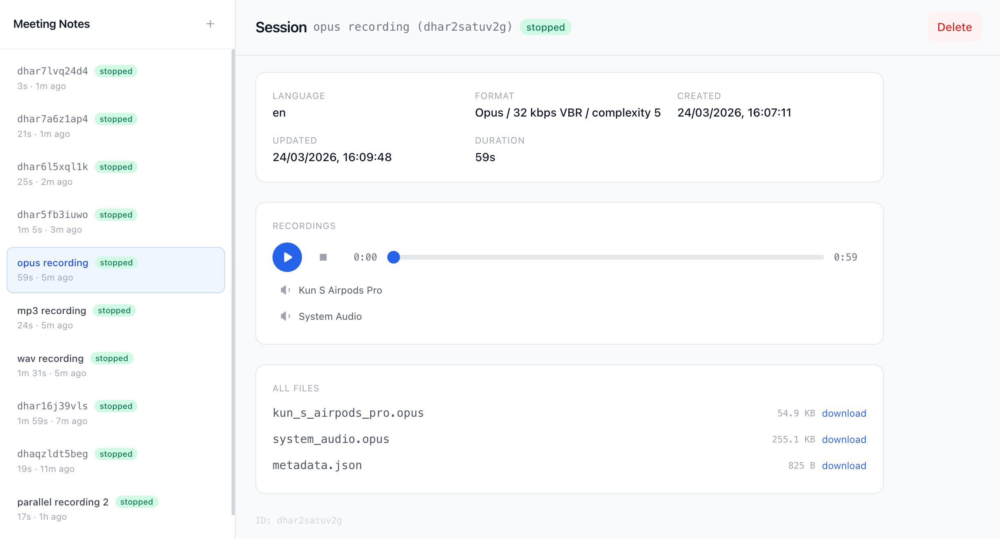

# meeting-notes

**meeting-notes** is a local-first meeting recorder and transcription tool. It captures microphone and system audio as separate tracks, transcribes and summarizes meetings, and exposes everything via a REST API with a built-in web UI.



## Features

- **REST API** — full resource-based API for session and recording management
- **Recordings management** — create, name, start/stop, delete sessions with persistent metadata
- **Multi-source recording** — capture microphone and system audio as separate tracks
- **Multi-format** — WAV (lossless), MP3 (CBR), and Opus (VBR) output
- **Web UI** — built-in single-page client with real-time updates via WebSocket
- **Low resource usage** — built with Rust; ~2% CPU for WAV, ~4% for Opus, ~6% for MP3

## Installation

Requires [Rust toolchain](https://rustup.rs).

```bash
cargo install --git https://github.com/rankun203/meeting-notes
```

## Usage

```bash
# Start the daemon with web UI
meeting-notes-daemon serve --web-ui

# Custom port and data directory
meeting-notes-daemon serve --port 8080 --data-dir ~/my-recordings --web-ui
```

Open `http://127.0.0.1:33487` in your browser.

## Architecture

```
┌───────────────────────────────────────────────────┐
│                meeting-notes daemon               │
│                                                   │
│  ┌────────────────────┐  ┌─────────────────────┐  │
│  │  Audio Capture     │  │  REST API +         │  │  ┌─────────────────────┐
│  │                    │  │  WebSocket          │──┼─▶│  Web UI (built-in)  │
│  │  macOS:            │  │                     │  │  └─────────────────────┘
│  │   Mic ── cpal      │  │  POST /sessions     │  │  ┌─────────────────────┐
│  │   Sys ── ProcessTap│  │  POST ../start      │──┼─▶│  Logseq (planned)   │
│  │                    │  │  POST ../stop       │  │  └─────────────────────┘
│  │  Linux: (TBD)      │  │  GET  ../files/:f   │  │  ┌─────────────────────┐
│  │   Mic ── cpal      │  │  WS   /ws           │──┼─▶│  Obsidian (planned) │
│  │   Sys ── PipeWire  │  │                     │  │  └─────────────────────┘
│  │                    │  └─────────────────────┘  │  ┌─────────────────────┐
│  │  Windows: (TBD)    │                           │  │  CLI / custom       │
│  │   Mic ── cpal      │                           │  └─────────────────────┘
│  │   Sys ── WASAPI    │                           │
│  └──────────┬─────────┘                           │
│             │                                     │
│             ▼                                     │
│  ┌────────────────────┐  ┌─────────────────────┐  │
│  │  Writers           │  │  Transcription      │  │
│  │  WAV (hound)       │  │  (planned)          │  │
│  │  MP3 (LAME)        │  │                     │  │
│  └──────────┬─────────┘  │  Speech-to-text     │  │
│             │            │  Summary + TODOs    │  │
│             ▼            └─────────────────────┘  │
│  ┌────────────────────┐           ▲               │
│  │  Session Storage   │           │               │
│  │  recordings/       │───────────┘               │
│  │    {id}/           │                           │
│  │      metadata.json │                           │
│  │      mic.mp3       │                           │
│  │      system.mp3    │                           │
│  └────────────────────┘                           │
└───────────────────────────────────────────────────┘
```

## API

| Resource | Method | Endpoint | Description |
|----------|--------|----------|-------------|
| Config | `GET` | `/config` | Available sources and config options |
| Sessions | `POST` | `/sessions` | Create a new session |
| Sessions | `GET` | `/sessions` | List sessions |
| Sessions | `GET` | `/sessions/:id` | Get session details |
| Sessions | `PATCH` | `/sessions/:id` | Rename session |
| Sessions | `DELETE` | `/sessions/:id` | Delete session and files |
| Recording | `POST` | `/sessions/:id/recording/start` | Start recording |
| Recording | `POST` | `/sessions/:id/recording/stop` | Stop recording |
| Files | `GET` | `/sessions/:id/files/:name` | Download/stream a file |
| Events | `WS` | `/ws` | Real-time session updates |

## Roadmap

- [ ] Full meeting transcription
- [ ] Speaker diarization
- [ ] Meeting summary and TODO extraction
- [ ] Logseq plugin
- [ ] Obsidian plugin
- [ ] Windows support
- [ ] Linux support

## Development

```bash
# Run with debug logging
RUST_BACKTRACE=1 RUST_LOG=meeting_notes_daemon=debug cargo run -- serve --web-ui
```
