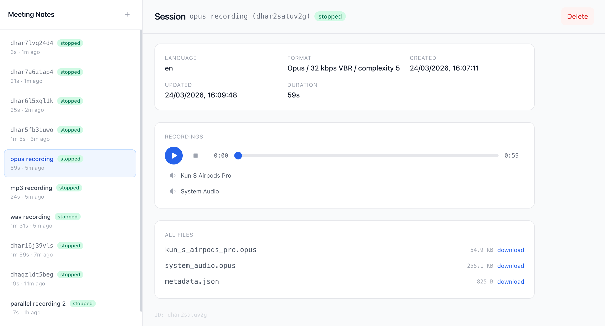

# meeting-notes

**meeting-notes** is a local-first meeting recorder and transcription tool. It captures microphone and system audio as separate tracks, transcribes and summarizes meetings, and exposes everything via a REST API with a built-in web UI.



## Features

- **Zero setup** — no virtual audio devices or kernel extensions needed, just install and run
- **Multi-track recording** — capture microphone and system audio simultaneously as separate tracks
- **Concurrent sessions** — run multiple recording sessions in parallel, each with its own set of audio tracks
- **Multi-format** — WAV (lossless), MP3 (CBR), and Opus (VBR) output
- **Recordings management** — create, name, start/stop, delete sessions with persistent metadata
- **Web UI** — built-in single-page client with real-time updates via WebSocket
- **REST API** — full resource-based API for session and recording management
- **Low resource usage** — built with Rust; ~2% CPU for WAV, ~4% for Opus, ~6% for MP3

## Installation

Requires [Rust toolchain](https://rustup.rs).

```bash
cargo install --git https://github.com/rankun203/meeting-notes
```

## Usage

```bash
# Start the daemon with web UI
meeting-notes-daemon serve --web-ui

# Custom port and data directory
meeting-notes-daemon serve --port 8080 --data-dir ~/my-recordings --web-ui
```

Open `http://127.0.0.1:33487` in your browser.

### macOS recording permissions

When running from this repository, use the macOS launcher:

```bash
bash scripts/run-macos.sh
# Optional server arguments:
bash scripts/run-macos.sh --port 8080 --data-dir ~/my-recordings
```

This builds and signs a local `target/macos/Meeting Notes.app`, then launches it
through macOS LaunchServices. Allow **Meeting Notes** to use your microphone and
record system audio when you start a recording. The launcher stays in the
foreground and streams daemon logs to your terminal (also saved in
`target/macos/meeting-notes.log`). Press **Ctrl+C** to stop the daemon and finalize
active recordings; press it again to force quit if shutdown is stuck. Stop any
existing daemon before launching the app on the same port.

To stop an instance from another terminal (including one started by the older
background launcher), run `./scripts/run-macos.sh --stop`. This requests a graceful
shutdown and finalizes active recordings without rebuilding the app.

The bundle includes `NSAudioCaptureUsageDescription` and
`NSMicrophoneUsageDescription`. These purpose strings let macOS present permission
requests ([Apple's Core Audio tap documentation](https://developer.apple.com/documentation/coreaudio/capturing-system-audio-with-core-audio-taps)).
Running `cargo run` or executing the binary directly can instead attribute those
requests to your terminal. If the terminal lacks the system-audio purpose string,
macOS may reject the request without showing a dialog, while Core Audio still
starts and returns silent buffers. The launcher avoids that terminal dependency;
executing the binary inside the `.app` directly does not.

If access was denied, enable **Meeting Notes** in **System Settings → Privacy &
Security → Microphone / Screen & System Audio Recording**, then restart the daemon
and recording. Local ad-hoc builds may need permission again after rebuilding.
Use `bash scripts/run-macos.sh --build-only` to prepare the bundle without launching
it or interrupting an existing CLI recording.

Live capture warnings measure incoming audio, independently of compressed file
size. After a 10-second startup grace period, missing buffers or initial system
silence generate a warning in both the UI and daemon logs. After sound has been
received, system silence is reported after 30 seconds. Silence alone cannot prove
permission was denied: nothing playing or an output-routing issue can also cause it.

## Architecture

```
┌───────────────────────────────────────────────────┐
│                meeting-notes daemon               │
│                                                   │
│  ┌────────────────────┐  ┌─────────────────────┐  │
│  │  Audio Capture     │  │  REST API +         │  │  ┌─────────────────────┐
│  │                    │  │  WebSocket          │──┼─▶│  Web UI (built-in)  │
│  │  macOS:            │  │                     │  │  └─────────────────────┘
│  │   Mic ── cpal      │  │  POST /sessions     │  │  ┌─────────────────────┐
│  │   Sys ── ProcessTap│  │  POST ../start      │──┼─▶│  Logseq (planned)   │
│  │                    │  │  POST ../stop       │  │  └─────────────────────┘
│  │  Linux: (TBD)      │  │  GET  ../files/:f   │  │  ┌─────────────────────┐
│  │   Mic ── cpal      │  │  WS   /ws           │──┼─▶│  Obsidian (planned) │
│  │   Sys ── PipeWire  │  │                     │  │  └─────────────────────┘
│  │                    │  └─────────────────────┘  │  ┌─────────────────────┐
│  │  Windows: (TBD)    │                           │  │  CLI / custom       │
│  │   Mic ── cpal      │                           │  └─────────────────────┘
│  │   Sys ── WASAPI    │                           │
│  └──────────┬─────────┘                           │
│             │                                     │
│             ▼                                     │
│  ┌────────────────────┐  ┌─────────────────────┐  │
│  │  Writers           │  │  Transcription      │  │
│  │  WAV (hound)       │  │  (planned)          │  │
│  │  MP3 (LAME)        │  │                     │  │
│  └──────────┬─────────┘  │  Speech-to-text     │  │
│             │            │  Summary + TODOs    │  │
│             ▼            └─────────────────────┘  │
│  ┌────────────────────┐           ▲               │
│  │  Session Storage   │           │               │
│  │  recordings/       │───────────┘               │
│  │    {id}/           │                           │
│  │      metadata.json │                           │
│  │      mic.mp3       │                           │
│  │      system.mp3    │                           │
│  └────────────────────┘                           │
└───────────────────────────────────────────────────┘
```

## API

| Resource | Method | Endpoint | Description |
|----------|--------|----------|-------------|
| Config | `GET` | `/config` | Available sources and config options |
| Sessions | `POST` | `/sessions` | Create a new session |
| Sessions | `GET` | `/sessions` | List sessions |
| Sessions | `GET` | `/sessions/:id` | Get session details |
| Sessions | `PATCH` | `/sessions/:id` | Rename session |
| Sessions | `DELETE` | `/sessions/:id` | Delete session and files |
| Recording | `POST` | `/sessions/:id/recording/start` | Start recording |
| Recording | `POST` | `/sessions/:id/recording/stop` | Stop recording |
| Files | `GET` | `/sessions/:id/files/:name` | Download/stream a file |
| Events | `WS` | `/ws` | Real-time session updates |

## Roadmap

- [x] Full meeting transcription
- [x] Speaker diarization
- [x] People management
- [x] Tags management
- [x] Chat with X (a particular meeting, person, tag)
- [x] Meeting summary and TODO extraction
- [ ] Search
- [ ] Logseq plugin
- [ ] Obsidian plugin
- [ ] Windows support
- [ ] Linux support

## Development

```bash
# Run with debug logging
RUST_BACKTRACE=1 RUST_LOG=meeting_notes_daemon=debug cargo run -- serve --web-ui
```

## Usage analytics

PostHog feature usage tracking is configured in **Settings → Usage analytics**.
The existing `posthog_project_token` key in `secrets.json` is supported directly.
See [event definitions and configuration](docs/usage-analytics.md).

## Next-generation design demo

The `next_gen` branch explores a recording-first workspace with persistent
playback, a compact file panel, and summary citation highlighting.
See the [design walkthrough, references, and demo instructions](docs/next-gen-experience.md).
