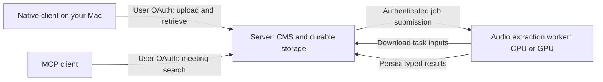

# Gday Meetings

Gday Meetings has three independently runnable components: a native **client**, a **server** for users and meeting storage, and an audio-processing **worker**. They share this repository so their HTTP contracts and deployment instructions stay together. Each has its own dependencies and release lifecycle.

| Component | Source | Runs where | Responsibility |
| --- | --- | --- | --- |
| Client (macOS, Rust) | [apps/client-macos-rust](apps/client-macos-rust) | On your Mac, outside Docker | Capture microphone/system audio, local UI and recordings, sign in and upload to the server. |
| Server | [apps/server](apps/server) | Local host/container or cloud | Payload CMS, canonical users and SSO, managed files, durable transcription jobs/results, authenticated HTTP MCP search. SQLite by default; PostgreSQL optional. |
| Audio extraction worker | [apps/worker-audio-extraction](apps/worker-audio-extraction) | Local host/container or GPU cloud | Speech recognition, alignment, diarization and speaker embeddings. CPU mode is supported; NVIDIA GPU acceleration is optional. |


```mermaid
flowchart LR
    C[Native client on your Mac] -->|User OAuth: upload and retrieve| S[Server: CMS and durable storage]
    S -->|Authenticated job submission| W[Audio extraction worker: CPU or GPU]
    W -->|Download task inputs| S
    W -->|Persist typed results| S
    M[MCP client] -->|User OAuth: meeting search| S
```

The client must run in the host OS to receive microphone and system-audio permissions. The server needs ordinary CPU resources and persistent storage. The worker has a separate Python/ML runtime and can use CPU or GPU hardware. Keeping these as separate packages means installing the client does not install the CMS or model stack, and replacing a worker does not move the meeting database.

## Start the native client

From the repository root on macOS:

```sh
make start       # Build and launch the .app from the client build directory
make install     # Build and open Finder for drag-to-Applications installation
make help        # List client, server and worker commands
```

`make start` opens the browser UI and streams logs until Ctrl+C. It neither installs to Applications nor starts Docker. `make install` opens a folder containing the app and an Applications shortcut; drag the app onto the shortcut, then open it from Applications. The installed app starts the client and opens its UI without needing the repository. This is a local ad-hoc signed build, not a notarized public binary release.

All client launches save daily logs under `~/Library/Logs/Gday Meetings/`, retaining up to 14 files. This includes double-clicking the installed app in Finder.

The server and worker are deployed independently and can live on different hosts. Each owns its Dockerfiles, Compose files and `.env.example`. Follow [deployment](docs/deployment.md), then use **Settings → Services → Login to Gday Meetings Server** in the client to connect to your server URL. Complete first-user setup at the server's `/admin` page first. The native client currently supports macOS; Make reports unsupported client platforms explicitly.

CPU execution takes longer than GPU execution. Model downloads require network access initially; speaker diarization additionally requires access to gated Hugging Face models. Once the required models are cached, processing can remain local. Local deployment does not require RunPod.

## Repository layout

```text
apps/
  client-macos-rust/       Rust client, UI, Cargo files, scripts and macOS packaging
  server/                 Payload/Next.js CMS, auth, APIs and server tests
  worker-audio-extraction/ Python ML worker, local HTTP and RunPod adapters
integrations/             Reserved Logseq and Obsidian integrations
tools/file-drop/           Optional helper for the direct RunPod workflow
docs/                     Architecture, deployment, and worklogs
Makefile                  Common commands delegating to independent components
```

A future native UI can live under `apps/client-macos-app/`; that application is not implemented yet. The client binary is `gday-meetings-client` and the macOS bundle is `Gday Meetings.app`. Existing local data paths and macOS app identity are preserved. The server source was brought back from the Gday Meetings repository; existing database names and previously published images retain their identities.

The GitHub repository URL still uses `meeting-notes`. The internal bundle identifier and data directory remain `org.rankun.meeting-notes` so existing recordings and permissions stay associated with the app. Stop and remove the old app bundle when replacing it with Gday Meetings; both use the same library and listening port. Historical worklogs and release notes retain their original names.

## Deployment and development

- [Architecture and integration contracts](docs/architecture.md)
- [Local CPU, local GPU and cloud deployment](docs/deployment.md)
- [Client usage and macOS permissions](apps/client-macos-rust/README.md)
- [Server setup and API documentation](apps/server/README.md)
- [Worker runtime and model setup](apps/worker-audio-extraction/README.md)
- [Client/server login and existing-meeting migration](docs/gday-meetings.md)
- [Deferred Payload collection redesign](docs/worklogs/2026-09-23-server-data-model-proposal.md)

Each component's README describes its own install and test commands. `make test-client`, `make test-server` and `make test-worker` run the respective suites. There is no root Cargo workspace, package manifest or Docker stack. Server container releases use `server-vX.Y.Z` tags and the independent package version in `apps/server/package.json`.
