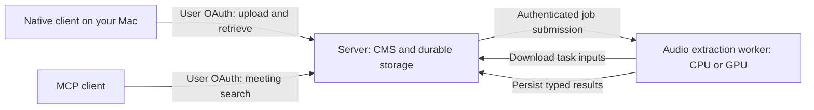

# Meeting Notes

Meeting Notes has three independently runnable components: a native **client**, a **server** for users and meeting storage, and an audio-processing **worker**. They share this repository so their HTTP contracts and deployment instructions stay together. Each has its own dependencies and release lifecycle.

| Component | Source | Runs where | Responsibility |
| --- | --- | --- | --- |
| Client (macOS, Rust) | [apps/client-macos-rust](apps/client-macos-rust) | On your Mac, outside Docker | Capture microphone/system audio, local UI and recordings, sign in and upload to the server. |
| Server | [apps/server](apps/server) | Local host/container or cloud | Payload CMS, canonical users and SSO, managed files, durable transcription jobs/results, authenticated HTTP MCP search. SQLite by default; PostgreSQL optional. |
| Audio extraction worker | [apps/worker-audio-extraction](apps/worker-audio-extraction) | Local host/container or GPU cloud | Speech recognition, alignment, diarization and speaker embeddings. CPU mode is supported; NVIDIA GPU acceleration is optional. |


```mermaid
flowchart LR
    C[Native client on your Mac] -->|User OAuth: upload and retrieve| S[Server: CMS and durable storage]
    S -->|Authenticated job submission| W[Audio extraction worker: CPU or GPU]
    W -->|Download task inputs| S
    W -->|Persist typed results| S
    M[MCP client] -->|User OAuth: meeting search| S
```

The client must run in the host OS to receive microphone and system-audio permissions. The server needs ordinary CPU resources and persistent storage. The worker has a separate Python/ML runtime and can use CPU or GPU hardware. Keeping these as separate packages means installing the client does not install the CMS or model stack, and replacing a worker does not move the meeting database.

## Start locally

1. Follow [local deployment](docs/deployment.md) to start the server and CPU worker with Docker Compose. Their data and downloaded models use persistent volumes.
2. Start the native client from the repository root:

   ```sh
   bash scripts/run-macos.sh
   ```

3. Open the client at `http://127.0.0.1:33487`. Under **Settings → Services**, use `http://localhost:3033` and **Login to Meeting Notes Server**. Complete first-user setup at the server's `/admin` page before signing in.

CPU execution takes longer than GPU execution. Model downloads require network access initially; speaker diarization additionally requires access to gated Hugging Face models. Once the required models are cached, processing can remain local. Local deployment does not require RunPod.

## Repository layout

```text
apps/
  client-macos-rust/       Rust client, embedded browser UI and client tests
  server/                 Payload/Next.js CMS, auth, APIs and server tests
  worker-audio-extraction/ Python ML worker, local HTTP and RunPod adapters
integrations/             Reserved Logseq and Obsidian integrations
scripts/                  Native macOS launcher and import utilities
tools/file-drop/           Optional helper for the direct RunPod workflow
docs/                     Architecture, deployment, and worklogs
Cargo.toml                Cargo workspace; the native client is the default member
```

A future native UI can live under `apps/client-macos-app/`; that application is not implemented yet. The current client binary remains `meeting-notes-daemon`, preserving installation commands, local data paths and macOS app identity. The server source was brought back from the GdayMeetings repository; existing database names and previously published images retain their identities.

## Deployment and development

- [Architecture and integration contracts](docs/architecture.md)
- [Local CPU, local GPU and cloud deployment](docs/deployment.md)
- [Client usage and macOS permissions](apps/client-macos-rust/README.md)
- [Server setup and API documentation](apps/server/README.md)
- [Worker runtime and model setup](apps/worker-audio-extraction/README.md)
- [Client/server login and existing-meeting migration](docs/gday-meetings.md)
- [Deferred Payload collection redesign](docs/worklogs/2026-09-23-server-data-model-proposal.md)

Each component's README describes its own install and test commands. From the repository root, `cargo build` and `cargo test --lib` select the Rust client; no server or worker is bundled into it. Server container releases use `server-vX.Y.Z` tags and the independent package version in `apps/server/package.json`.
