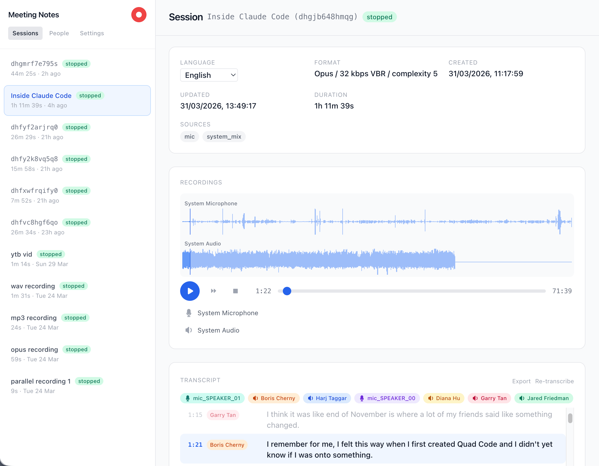

# client-macos-rust

The native macOS Rust client in the [Gday Meetings client/server/worker architecture](../../docs/architecture.md). Run commands below from the repository root.

**gday-meetings** is a local-first meeting recorder and transcription tool. It captures microphone and system audio as separate tracks, transcribes and summarizes meetings, and exposes everything via a REST API with a built-in web UI.



## Features

- **Zero setup** — no virtual audio devices or kernel extensions needed, just install and run
- **Multi-track recording** — capture microphone and system audio simultaneously as separate tracks
- **Concurrent sessions** — run multiple recording sessions in parallel, each with its own set of audio tracks
- **Multi-format** — WAV (lossless), MP3 (CBR), and Opus (VBR) output
- **Recordings management** — create, name, start/stop, delete sessions with persistent metadata
- **Web UI** — built-in single-page client with real-time updates via WebSocket
- **REST API** — full resource-based API for session and recording management
- **Low resource usage** — built with Rust; ~2% CPU for WAV, ~4% for Opus, ~6% for MP3

## Installation

Requires macOS, the [Rust toolchain](https://rustup.rs) and Xcode Command Line Tools. From the repository root:

```bash
make install
```

This builds an ad-hoc signed `Gday Meetings.app` and opens a Finder folder with an Applications shortcut. Drag the app onto Applications, then double-click the installed app. It starts the local server and opens the browser UI. The app uses the same existing data directory and macOS bundle identity. The installer folder is a separate copy, so dragging it away does not remove the development build. Close a running installed app before replacing it in Finder.

This workflow uses built-in `ditto`, `codesign` and Finder; it does not need a DMG builder or copy over `/Applications` automatically. For command-line-only installation, `cargo install --git https://github.com/rankun203/meeting-notes gday-meetings-client` remains available.

## Usage

```bash
# Build and run the local app without installing it
make start
make start CLIENT_ARGS="--port 8080"

# CLI use after cargo install (terminal permissions apply)
gday-meetings-client serve --web-ui

# Custom port and data directory
gday-meetings-client serve --port 8080 --data-dir ~/my-recordings --web-ui
```

Open `http://127.0.0.1:33487` in your browser.

For durable transcription results and a shared recordings admin, connect
[Gday Meetings Server](../server). See the
[setup and migration guide](../../docs/gday-meetings.md).

### macOS recording permissions

When running from this repository, use the macOS launcher:

```bash
make start
# Optional server arguments:
make start CLIENT_ARGS="--port 8080 --data-dir ~/my-recordings"
```

This builds and signs `apps/client-macos-rust/target/macos/Gday Meetings.app`, then launches it
through macOS LaunchServices. Allow **Gday Meetings** to use your microphone and
record system audio when you start a recording. The launcher stays in the
foreground and streams daemon logs to your terminal (also saved in
`apps/client-macos-rust/target/macos/gday-meetings.log`). Press **Ctrl+C** to stop the daemon and finalize
active recordings; press it again to force quit if shutdown is stuck. Stop any
existing daemon before launching the app on the same port.

To stop an instance from another terminal (including one started by the older
development launcher), run `make stop`. This requests a graceful
shutdown and finalizes active recordings without rebuilding the app.

The bundle includes `NSAudioCaptureUsageDescription` and
`NSMicrophoneUsageDescription`. These purpose strings let macOS present permission
requests ([Apple's Core Audio tap documentation](https://developer.apple.com/documentation/coreaudio/capturing-system-audio-with-core-audio-taps)).
Running `cargo run` or executing the binary directly can instead attribute those
requests to your terminal. If the terminal lacks the system-audio purpose string,
macOS may reject the request without showing a dialog, while Core Audio still
starts and returns silent buffers. The launcher avoids that terminal dependency;
executing the binary inside the `.app` directly does not.

If access was denied, enable **Gday Meetings** in **System Settings → Privacy &
Security → Microphone / Screen & System Audio Recording**, then restart the daemon
and recording. Local ad-hoc builds may need permission again after rebuilding.
Use `make build` to prepare the bundle without launching
it or interrupting an existing CLI recording.

Live capture warnings measure incoming audio, independently of compressed file
size. After a 10-second startup grace period, missing buffers or initial system
silence generate a warning in both the UI and daemon logs. After sound has been
received, system silence is reported after 30 seconds. Silence alone cannot prove
permission was denied: nothing playing or an output-routing issue can also cause it.

## Architecture

This package captures and retains local audio, embeds the browser UI, and exposes a loopback API. It authenticates to [the server](../server) for managed uploads and durable jobs. The [worker](../worker-audio-extraction) runs separately; its Python/ML dependencies are not installed with this client. See [system architecture](../../docs/architecture.md).

## API

| Resource | Method | Endpoint | Description |
|----------|--------|----------|-------------|
| Config | `GET` | `/config` | Available sources and config options |
| Sessions | `POST` | `/sessions` | Create a new session |
| Sessions | `GET` | `/sessions` | List sessions |
| Sessions | `GET` | `/sessions/:id` | Get session details |
| Sessions | `PATCH` | `/sessions/:id` | Rename session |
| Sessions | `DELETE` | `/sessions/:id` | Delete session and files |
| Recording | `POST` | `/sessions/:id/recording/start` | Start recording |
| Recording | `POST` | `/sessions/:id/recording/stop` | Stop recording |
| Files | `GET` | `/sessions/:id/files/:name` | Download/stream a file |
| Events | `WS` | `/ws` | Real-time session updates |

## Roadmap

- [x] Full meeting transcription
- [x] Speaker diarization
- [x] People management
- [x] Tags management
- [x] Chat with X (a particular meeting, person, tag)
- [x] Meeting summary and TODO extraction
- [ ] Search
- [ ] Logseq plugin
- [ ] Obsidian plugin
- [ ] Windows support
- [ ] Linux support

## Development

```bash
# Run the app with debug logging
RUST_BACKTRACE=1 RUST_LOG=gday_meetings_client=debug make start
make test-client

# Or work directly inside this independent Cargo package
cd apps/client-macos-rust
cargo test --locked
bash scripts/build-macos.sh
bash scripts/run-macos.sh --port 8080
```

Finder launches without arguments default to `serve --web-ui --open`. Explicit CLI arguments retain their usual behavior. The app currently uses the browser UI and runs in the background; closing the browser does not stop it. Use Activity Monitor to quit an installed copy, or `make stop` for the development copy. Ordinary CLI invocation still requires a subcommand.
