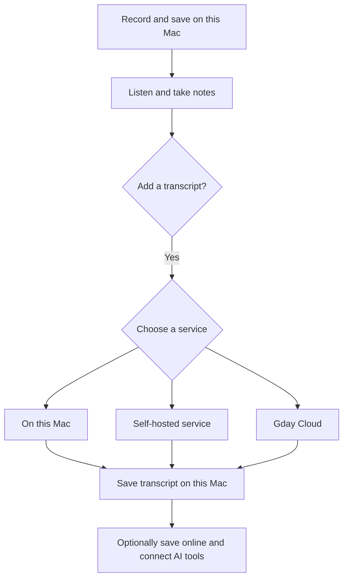

# Gday Meetings experience

This document describes the intended experience. Some features still need to be built.

## Start with recording

Recordings are saved on this Mac. Transcription is optional.

Anyone can record, listen, take notes, organize meetings, and export files without an account or internet connection. Transcription and online services are optional.

Present three options on the website:

| Option | Description | Get started | Cost |
| --- | --- | --- | --- |
| **Just recording** | Record, listen, and take notes offline. Recordings and notes are saved on this Mac. | Download the app | No Gday Points charge |
| **Self-deployment** | Run transcription on your Mac or server. Add a Gday Meetings website if needed. | Set up a service | Pay for the hardware and services you use |
| **Cloud** | Use Gday Meetings for transcription, online storage, and access from AI tools. | Create an account at gdaymeetings.com | Pay for transcription with Gday Points. No separate storage charge. |

Give each option equal visibility. Explain where audio goes and who can access it. Describe only available features, and avoid promising unlimited storage before a storage policy exists.

People can combine these options. For example, they can transcribe on their Mac and save selected meetings to the website.

## Keep the choices separate

Organize the app around what people want to do:

1. **Record a meeting.** Save, listen, take notes, and export.
2. **Create a transcript.** Choose a transcription service and optional speaker labels.
3. **Access meetings elsewhere.** Choose what to save online and which tools can access it.
4. **Configure a service.** Set its address, model, access token, and storage policy.

Keep recording storage, transcription, and online access independent. Signing in does not upload meetings or change the transcription service. The local library remains available offline.



Cloud transcription uploads audio for processing. Keeping that audio in the website library is a separate choice.

## Service providers

A **provider** is a configured service or account. A **capability** is an operation it provides, such as transcription or search. Each provider can offer one or more capabilities, with its own settings.

The three website options describe ways to use the product. In the app, manage connections in **Settings → Service Providers**. People can add several providers and use a different one for each task.

| Capability | Interface label | What it does | Data sent to a remote provider |
| --- | --- | --- | --- |
| Transcription | Transcription | Turns speech into timed text | Selected audio tracks |
| Diarization | Speaker Labels | Marks when each speaker talks | Selected audio tracks; timed transcript if needed |
| Summarization | Summaries | Creates a summary from meeting text | Transcript and any notes explicitly included |
| Search | Search | Finds meetings and matching passages | Selected transcripts and summaries, plus search queries |
| Playback | Playback | Stores original audio for listening from other devices | Selected original audio files |

Remote search keeps a searchable copy of selected text. Remote playback keeps a copy of original audio. These uploads need separate permission. Uploading audio for transcription does not enable remote playback or retain an audio library.

Language belongs to each meeting's recording configuration. Choose it when creating the meeting and edit it in that meeting later. New meetings use **Settings → Recording → Default Language**, initially English. Changing the default leaves existing meetings unchanged. Starting transcription snapshots that language for the request; changes apply to future attempts. The transcription provider reports the available language choices through its [metadata operation](../protocols/transcription.md#discover-supported-languages); the app has no fallback language catalog. Its settings do not choose the meeting language. If metadata is unavailable, preserve the saved choice and keep recording available. If a valid list excludes the choice, require a supported language before a new transcription.

Local playback and recording always work without a provider. Local library search stays available for locally stored content. **On This Mac** represents optional built-in processing; it has no account or network address and only lists capabilities installed on the device.

A large language model (LLM) service can create summaries. The examples below describe the target design; they do not indicate current compatibility:

| Provider | Capabilities | Connection |
| --- | --- | --- |
| On This Mac | Supported local capabilities | Model setup where needed |
| Simple transcription service | Transcription | Address and optional access token |
| Audio worker | Transcription and Speaker Labels | Address and optional access token |
| OpenAI-compatible LLM service | Summaries | Address, model, and authentication if required |
| Self-hosted Gday Meetings website | All five capabilities | Website address and login |
| Gday Cloud | All five capabilities | Gday account login |

A full Gday Meetings provider presents the complete service, even when it delegates processing to workers. If a worker or model is missing, the affected capability shows **Setup Required**. Login alone does not make every capability ready.

### Provider list

Use the two-column layout in the supplied Calendar Accounts reference. The left column lists providers. The right column shows the selected provider's settings. Use the Internet Accounts references for grouped capability rows and the richer Cloud account panel.

Each provider row shows an icon, a name, and a short status or enabled-capability summary. Custom names such as “Office Server” help distinguish two instances of the same service. Show the account or server address in the detail panel.

Place Add (+) and Remove (−) below the list, with accessible labels **Add Provider** and **Remove Provider**. Keep the built-in On This Mac entry; its optional features can be disabled, but the entry cannot be removed.

The detail panel contains:

1. **Provider details:** name, account or address, connection status, and **Details…**.
2. **Enable This Provider:** pauses or allows its use without removing settings.
3. **Capabilities:** one row for each supported capability, with a switch, setup status, and settings where needed.
4. **Provider settings:** models, connection details, or Cloud account controls.
5. **Remove Provider…:** removes the connection from this app.

Example with illustrative names and balances:

```text
Service Providers

On This Mac          │  Gday Cloud
Office Server        │  alex@example.com               Details…
Writing Model        │  Healthy
Gday Cloud           │  [✓] Enable This Provider
                     │
                     │  Transcription       On        Settings…
                     │  Speaker Labels      On        Settings…
                     │  Summaries           Off       Settings…
                     │  Search              Off       Set Up…
                     │  Playback            Off       Set Up…
                     │
                     │  Gday Points: 6 available       Buy Points…
                     │  Usage History…
+  −                 │  Remove Provider…
```

The example shows a configured account. New remote providers start with capabilities off. A capability switch makes the provider available for that task; it does not make it the default, start processing, or authorize a charge.

For Search and Playback, turning the switch on first opens setup. Show what will be uploaded, which meetings are selected, and how long copies are kept. Default to selected meetings. Offer **Keep Selected Meetings Updated** separately, and require explicit selection to include future meetings. Confirm with **Enable Search and Upload** or **Enable Playback and Upload**. Cancel leaves the capability off.

Do not show unsupported capabilities as working switches. List only supported rows. If a supported feature is unavailable, keep its row and explain what is needed. A new capability introduced by a provider update starts off.

### Add and configure a provider

**Add Provider…** offers **Gday Cloud**, **Gday Meetings Website**, **Audio Service**, and **OpenAI-Compatible Model**. Choose a connection type, then enable its capabilities.

Enter an address and optional token for a custom service, or sign in for a website account. Test the connection without uploading meeting content. Then show supported capabilities and any missing setup. Save the provider without enabling uploads or changing task defaults.

Keep common controls in the same places. Give each provider the fields it needs:

| Provider type | Settings |
| --- | --- |
| On This Mac | Models, supported languages, download size, and device support |
| Audio service | Address, authentication, transcription model, and speaker settings |
| LLM service | Address, authentication, model, and summary instructions |
| Gday Meetings website | Account, capability settings, selected meetings, online copies, and AI tool access through Model Context Protocol (MCP) |
| Gday Cloud | Website settings plus Gday Points, purchases, and usage history |

The Cloud panel can be richer, like the supplied iCloud reference. Lead with account details and point balance, then capabilities and online content. Show storage usage without a storage purchase control. Confirm the price in the meeting before each paid request.

### Choose a provider for each task

**Settings → Defaults** has one section per capability. It selects the default transcription and speaker-label providers, and the default summary provider. Each starts at **None** until explicitly chosen. Pickers list enabled providers that support the task and explain unavailable choices.

Per-meeting actions show the selected provider and allow a change. Adding, signing in to, or enabling a provider never changes these defaults. If a provider fails or is disabled, keep the choice visible and ask the person to retry or choose another provider.

Transcription and speaker labels can come from the same provider or different providers. If different, explain that audio will go to both. Explain the destinations and applicable provider charges in the provider panels. For configured providers, **Transcribe** starts the task without another confirmation. A combined request may reuse one upload, but still needs both capabilities enabled. If speaker labeling fails, keep the successful transcript.

Summary generation uses the selected transcript version. It does not require Search. Search uploads transcripts and summaries that already exist; it does not generate missing summaries. Playback does not require any text capability. For remote search, let people choose a connected library and label result sources. Search and Playback can be enabled for several providers without choosing one global upload destination.

### Disable or remove a provider

Turning off a capability stops new requests and automatic updates for that capability. Turning off the provider pauses all its capabilities. Preserve its settings, selected defaults, and local results. Show affected queued and active requests, with cancellation where supported.

Turning a switch off does not delete remote copies. Show **Manage Online Copies…** for deletion and **Manage AI Access…** for MCP grants. Explain pending deletion if the provider is offline; do not report it as complete.

Use **Remove Provider…**, not Delete Account. Explain which remote copies and active jobs remain, offer to download remote-only audio, and remove local credentials. Deleting the website account is a separate action. Changing an address or account requires a new connection check and updated destination details in the panel.

### File transfer for workers

Some transcription workers accept audio URLs rather than local files. Configure a separate file-transfer provider and select it in the worker's panel. The [file-transfer contract](../protocols/file-transfer.md) defines temporary uploads and expiry. This is a transport dependency, separate from Search and Playback.

Explain both destinations in the provider panels: Filedrop stores the audio temporarily, and RunPod retrieves it for processing. Include a brief note that RunPod charges may apply. **Transcribe** starts this configured workflow in one click, without a recurring upload dialog. Filedrop download links permit access to anyone holding the link until expiry. Saving either provider or opening its panel checks the connection without uploading audio. Filedrop checks credentials with an empty request that validates the key and stops before creating a file.

### Common capability protocols

Define a versioned contract for each capability. The app uses these contracts regardless of the provider. Gday services implement them directly; adapters translate other APIs, such as an OpenAI-compatible LLM API, into the same contracts. Compatibility with an LLM API does not imply support for transcription, search, or playback.

The [capability protocols](../protocols/README.md) define purpose, inputs, operations, results, and adapter behavior. Each document distinguishes implemented transport behavior from remaining work.

| Contract | Required operations | Result |
| --- | --- | --- |
| [Transcription](../protocols/transcription.md) | Submit audio, inspect progress, cancel when supported, retrieve result | Timed text with language and source-track information |
| [Diarization](../protocols/diarization.md) | Submit audio and optional timed text, inspect progress, retrieve result | Speaker time ranges tied to the same audio timeline |
| [Summarization](../protocols/summarization.md) | Submit a transcript version and optional notes, inspect progress, retrieve result | Summary linked to its input version |
| [Search](../protocols/search.md) | Add/update/delete selected text, inspect indexing status, query | Meeting references, matching passages, and source versions |
| [Playback](../protocols/playback.md) | Upload/delete original audio, inspect availability, retrieve or stream with seeking | Authorized audio access and track metadata |

Every contract defines authentication, supported versions, input limits, readiness, progress, errors, and retry behavior. Providers report model/language support, live versus batch processing, cancellation support, data retention, and any cost. The app validates these reports; advertised security claims are not proof of protection.

Keep **supported**, **enabled**, **ready**, and **selected as default** as separate states. Identify provider instances and accounts separately from display names. Use stable meeting, track, request, and content-version IDs so retries do not duplicate work or overwrite edits. Results record their provider and model. Remote audio access must be authorized, not a permanent public link.

Search updates and deletions include derived indexes. Each provider keeps its own sync status and consent. MCP is an optional way to expose authorized search and retrieval, with separate grants; enabling Search alone does not grant an AI tool access.

### Grow one capability at a time

The provider model lets Gday Meetings grow gradually. Ship a provider with one useful capability, then add others as they become ready. New providers fit into the same settings and meeting actions.

For example, first connect a transcription-only audio service. Later, add Speaker Labels to that provider, connect an LLM for Summaries, and add a Gday Meetings website for Search and Playback. Each step adds a feature without replacing the local library or requiring the other steps.

Build and test each capability independently. Keep existing contract versions working during migrations, and show **Update Required** when a provider's version is incompatible. A failure or missing feature in one capability must not block the others. An offline Search service, for example, must not prevent local recording or transcription through another provider.

When support changes, refresh the provider's capability list and show newly available features off. Let people enable them when ready. If a capability disappears, preserve its settings and existing results, mark it unavailable, and offer another provider. Do not reroute requests or broaden upload permissions automatically.

The full Gday Meetings website remains the target provider for all five capabilities. During development, expose only the capabilities that work. Release individual providers as their capabilities become available.

## Record a meeting

### Open the app

Open to the library with a prominent **Record Meeting** button. If the library is empty, show:

> No recordings
>
> Select Record Meeting to start a recording.

Offer **Set Up Transcription…** as an optional action. Recording needs no setup wizard. Ask for microphone or system audio permission when someone selects that source. Allow microphone-only recording.

### Before recording

Show the audio sources, input levels, save location, and **Transcription: Off**. Keep **Record Meeting** and the audio controls easy to find.

If local transcription needs a model, show its download size and progress, with an option to cancel. Recording remains available during setup. Once installed or imported and verified, local models must work offline.

### During recording

Show elapsed time, source levels, notes, and **Stop Recording**. Use **Saving on this Mac** while recording.

When live transcription is enabled, show its state: Preparing, Listening, or Interrupted. Distinguish unfinished text from confirmed text. If transcription fails, keep recording. If the network disconnects, keep the selected service; never send audio to another service automatically.

Report recording and storage failures separately from transcription problems.

### After recording

Save the audio, then open the meeting for playback. Do not confirm a successful save. If saving fails, show an alert that states what failed and which audio was kept.

If transcription is not configured, the transcript area says:

> No transcript yet
>
> Choose a provider to create a transcript of this recording.
>
> **Set Up Transcription…**

For a configured provider, show **Transcribe**. One click starts the task. Keep upload destinations, temporary-link access, and charge details in its provider panel. Future Gday Cloud quotes use the separate flow below.

Allow a different service for each meeting. Changing the default affects new requests only. Requests already submitted keep their original service and permissions.

## Set up transcription

Show configured providers that support Transcription, including **On This Mac** when available. Show readiness, supported languages, and where audio goes. Offer **Add Provider…** for another connection. On first use, the chooser can introduce local processing, a self-hosted service, and Gday Cloud before opening the matching provider setup.

Speaker labels distinguish voices. Naming a speaker is a separate feature. Saving voice profiles requires permission and a way to delete them.

### On this Mac

Use a built-in transcription engine when supported. Show device requirements, supported languages, model size, and availability of live text and speaker labels.

Follow the [live transcription research](../live-transcription-research.md): evaluate Apple Speech and multilingual Whisper, while keeping recording available on macOS 14.2. Test English, Mandarin, and mixed-language accuracy before release.

If a model is missing, show **Download Model**. Do not switch to Cloud.

### Self-hosted service

Offer two connection types:

| Connection | Setup | Adds |
| --- | --- | --- |
| **Transcription service** | Service type, address, optional access token, and Test Connection | Transcription on a local or remote worker |
| **Gday Meetings website** | Website address and browser sign-in | All available capabilities and optional MCP access; each is enabled separately |

Distinguish the Gday worker API from other compatible transcription APIs. A worker running on the same Mac belongs here because the person using it manages the service.

Label verified loopback addresses **This Mac**. Label other addresses **Remote Server**, including those on a local network.

Use HTTP for local connections and HTTPS by default for remote connections. An advanced setting can allow HTTP on a trusted network. Explain that HTTP sends audio and tokens without encryption, and remember the choice for that service. Never switch from HTTPS to HTTP automatically.

Allow connections without a token only when the service supports them. Store credentials in Keychain, and exclude them from URLs, logs, and exports.

**Test Connection** checks the address, authentication, API compatibility, models, and supported features without uploading a recording. Show each problem where it can be fixed. Use **Update Token…** for an expired token and **Sign In Again…** for an expired website session.

A standalone worker must accept audio uploads directly and return job status and results. It must not require a website server or a public audio URL. Define access controls and deletion times for those uploads. The current worker API needs changes to support this.

### Gday Cloud

This point-based billing flow is proposed and is not part of the current RunPod or website transcription action.

Register or sign in at gdaymeetings.com in a browser, then return to the app. Show the account, point balance, and service status. The account supplies access to Cloud services.

Before each paid request, show the duration, features, destination, point cost, and how long uploaded files will be kept. Let the person confirm the request with **Transcribe · N Points**.

Signing in or buying points does not start transcription. By default, upload audio for processing only. Offer a separate choice to keep the meeting online.

Example review sheet:

```text
Transcribe with Gday Cloud

Design review · 42 min
Microphone and system audio · Speaker labels on

Cost: 2 Gday Points
Balance after transcription: 4 points

Gday Cloud will receive the audio for transcription.
[ ] Keep audio and transcript in the Gday Cloud library

Cancel                         Transcribe · 2 Points
```

Before release, add the exact deletion period for processing copies to this sheet. Also allow saving the transcript without the audio. Let people choose whether to upload notes and speaker data.

Start with transcription after recording. Live Cloud transcription requires separate work. Registration, billing, private accounts, and scheduling across workers also need implementation.

## Pay with Gday Points

**1 Gday Point covers 30 minutes. Each transcription costs at least 1 point.** Storage has no separate charge. The point price will include a small markup on processing costs; the amount is undecided.

The following billing rules are proposals.

### Calculate the cost

Use whole points and round up each meeting's duration:

| Duration | Points |
| --- | --- |
| 12 minutes | 1 |
| 30 minutes | 1 |
| 30 minutes, 1 second | 2 |
| 60 minutes | 2 |

For valid audio, the formula is `max(1, ceil(durationSeconds / 1800))`.

Count meeting time once, including when microphone and system audio overlap. Two simultaneous 42-minute tracks cost 2 points. Reject empty or unreadable audio before reserving points. Imported clips need a defined meeting timeline before calculating the cost.

Including speaker labels in this price is proposed, pending cost testing.

### Reserve and charge points

Reserve the quoted points when accepting a request. Charge once, after saving a usable result. Release reserved points if processing fails, expires, or is canceled before the result is saved. A completed result remains charged and available.

Retries and result recovery never incur another charge. Transcribing again requires a new quote. Minimum spend applies to the whole request, not each audio track or processing chunk.

Show Available, Reserved, and Spent points in a history linked to meetings. The server must prevent duplicate charges and overspending from simultaneous requests. It must also release abandoned reservations and handle duration mismatches. Never charge more than the accepted quote. Ask for confirmation again if a quote expires.

## Settings and errors

Group settings under **Recording**, **Service Providers**, **Defaults**, and **AI & Integrations**. Service Providers contains connection details, capability switches, models, online copies, and account settings. Defaults selects the provider for each capability, with one section per capability. AI & Integrations manages tool access. Cloud points and purchases stay in the Cloud provider panel.

Summaries and chat need their own service choice and permission to send text. Permission to transcribe does not include sending notes or transcripts to an AI service.

Store the selected service separately from its availability. A service can be selected but need setup, a model download, or sign-in. Track recording, transcription, and sync independently.

Show problems beside the affected feature, with a useful action:

The messages below are interface copy. Replace bracketed values with the provider name, price, or balance. Behavior belongs in the last column.

| Situation | Message | Action | Behavior |
| --- | --- | --- | --- |
| No provider selected | Choose a provider to transcribe this recording. | Set Up Transcription… | Open setup without sending audio. |
| Required token missing | Enter an access token for [Provider Name]. | Add Token… | Open the provider's token field. |
| Website session expired | Sign in to [Provider Name] again to transcribe this recording. | Sign In Again… | Keep HTTP details in diagnostics. |
| Token rejected | Update the access token for [Provider Name]. | Update Token… | Keep HTTP details in diagnostics. |
| Local model missing | Download a model to transcribe on this Mac. | Download Model | Show size before download. |
| Service unavailable | Couldn't connect to [Provider Name]. Try again. | Retry | Keep the selected provider. |
| Offline with Cloud selected | Connect to the internet to transcribe with Gday Cloud. | Retry | Keep the recording available locally. |
| Insufficient points | This transcription costs [N] points. Available balance: [M] points. | Buy Points… | Do not submit the request. |
| Upload interrupted | The audio upload to [Provider Name] was interrupted. Try again. | Retry Upload | Resume the same request without another charge. |
| Processing failed | [Provider Name] couldn't transcribe this recording. Try again or choose another provider. | Retry / Choose Provider… | Keep the audio and any existing transcript. |
| Worker security check failed | The server's security check failed. Transcription is paused. | Cancel | Keep the job paused until a worker passes verification. |

Where audio has been saved, say so. Keep queued requests visible and cancellable. Upload later only with permission and a valid quote.

Automatic transcription starts off. When enabled, state which service receives the audio. Initially, Cloud requests always require cost confirmation. Later automation needs spending limits and explicit permission.

Signing out stops new uploads and requests, removes credentials, and keeps local meetings. Explain any requests already accepted by the server and offer cancellation where possible. Before disconnecting a website, offer to download meetings stored only there. Changing a default does not move or delete existing content.

## Website and AI access

Use **Gday Meetings website** in the interface. Reserve “content management system (CMS)” for technical documentation. Self-hosted websites and gdaymeetings.com use the same meeting concepts, but have different operators and billing options.

MCP lets AI tools access meetings through the website. Show which meetings a tool can search, ask for permission, and allow access to be revoked. Revoking access cannot remove content a tool has already retrieved.

Before hosting unrelated accounts, verify that each account can access only its own meetings, audio, jobs, results, downloads, search results, and callbacks. Existing OAuth support is not sufficient proof. The current server documentation describes a shared workspace.

### Encrypted storage and search

Choose the storage design explicitly:

| Storage | Who can read it? | Search and MCP |
| --- | --- | --- |
| Server-readable | The user and server operator | Ordinary server search and MCP work |
| Encrypted on the client | Holders of the decryption keys | Requires local search, a user-controlled service, or verified confidential processing |

Prefer client-encrypted storage as the long-term goal. If server-readable search is offered, make it a separate choice. Never decrypt a library silently to enable MCP.

Encrypted storage also needs key setup, backup, recovery, and browser access. Account login alone does not provide a decryption key. Protect transcripts, notes, voice data, and search indexes as well as audio.

## Protect recordings on remote workers

The goal is to keep recordings private from the worker's host administrator, other users, and storage or queue operators.

Docker, HTTPS, and disk encryption do not prevent a host administrator from accessing audio while an ordinary worker processes it. Self-hosting requires trust in that machine's operator.

Confidential computing is a possible solution. It uses protected CPU and GPU environments and verifies them before releasing encryption keys. NVIDIA documents this verification, called attestation, including restrictions on host access. AWS enclaves provide another isolation approach; compatibility with this audio pipeline still needs testing. [NVIDIA attestation](https://docs.nvidia.com/datacenter/cloud-native/confidential-containers/latest/attestation.html), [AWS enclave security](https://docs.aws.amazon.com/enclaves/latest/user/security.html).

### Proposed experiment

This is a research plan, not a reviewed security protocol.

1. Encrypt audio on the client with a new key for each job. Send only encrypted audio and required routing information to storage and the scheduler.
2. Verify fresh evidence for the worker's CPU, GPU, approved code and models, and job-specific public key. Check it against the client's security policy. A GPU certificate alone is insufficient.
3. Release the job key only to the verified environment. Keep decoding, transcription, alignment, speaker labeling, and result encryption inside it. Prevent unencrypted data in temporary files, logs, crash reports, host-accessible swap, or unauthorized network traffic.
4. Encrypt results and voice data for the client before upload. Limit each worker's access to its job. Verify replacement workers before retrying.
5. Decrypt results on the client. Define key backup and deletion. Lost keys may make recordings unrecoverable; giving the website an unrestricted recovery key would let it read them.

Initially, keep the client online while it verifies the worker and releases keys. Supporting offline clients requires a separately reviewed service that releases keys only to verified workers. Approved software lists and app updates must also be protected against a malicious operator, using signed, reviewable builds and client-enforced policy.

Workers may run in different locations. Assign jobs only to workers that meet the chosen security, region, and feature requirements. Give them temporary access to one job, never the whole library. Keep ordinary workers and confidential workers clearly distinguished. If protection from host administrators is required for launch, Cloud must wait until that protection is validated.

Before release, test host access to memory, files, and logs; altered or expired verification evidence; data leaks through outputs or network requests; account isolation; the full audio pipeline; key deletion; retries; speed; and cost. Obtain an independent security review.

State the tested protections and limits. Confidential computing still depends on hardware, firmware, and approved software. It does not hide every file size or timing detail, or prevent service outages.

## Build in stages

| Stage | Work | Required result |
| --- | --- | --- |
| 1. Recording | Add an explicit “no service” state and setup messages. | With no keys or network, recording, playback, notes, organization, and export work. Transcribe opens setup without sending a request. |
| 2. Service Providers | Add the two-column provider panel, capability contracts, task defaults, and settings migration. | A transcription-only provider works independently. Supported, enabled, ready, and default states are distinct. Preserve credentials without inferring upload permission. Existing jobs retain their original destination. |
| 3. Local transcription | Add an on-device engine and direct worker uploads. | Installed models work offline. Local and remote workers handle authentication correctly. English and Chinese quality tests pass. |
| 4. Website and MCP | Add separate sync choices and access controls. | Account isolation, export, deletion, and revoked access are tested. Storage and search permissions are clear. |
| 5. Cloud billing | Add quotes, point history, and job recovery. | Costs are correct at duration boundaries. Retries charge once. Failures release points. Login and purchases do not upload audio. |
| Security research | Test confidential workers alongside this work. | Verify the complete pipeline and obtain an independent review before making privacy claims. |
| Launch | Publish the three website options. | Copy matches released features, prices, storage policies, and tested protections. |

Release providers and capabilities as they pass their own checks. This sequence does not require all five capabilities or the full website to ship together.

### Validation in UI Preview

Use UI Preview for the real provider setup and job flows with an isolated temporary library. It keeps Keychain access, real capture, and hardware playback disabled. Network requests remain available: connection checks send no meeting content, and selected content uploads only when a service task is deliberately started. Use synthetic recordings by default and report which service actions were actually tested.

### Current implementation gaps

Implementation status on 2026-09-26:

- [Provider settings](../../apps/client-macos-swift/Sources/GdayMeetings/Services/ServiceProviders.swift) now start with no providers or external endpoint. Transcription and summaries require an explicitly selected, enabled provider. Save and panel entry check the configured connection without sending meeting content.
- RunPod transcribes local recordings through an explicitly selected Filedrop provider. Its provider panels explain both destinations, temporary-link access, and charges. Transcribe starts the configured task directly. [File transfer](../protocols/file-transfer.md) uses temporary download links; it is not end-to-end encryption.
- [Provider transcription](../../apps/client-macos-swift/Sources/GdayMeetings/Core/ProviderTranscription.swift) saves upload receipts and job progress. It preserves edits made during processing and retains the returned transcript for an explicit replacement.
- The [worker API](../../apps/worker-audio-extraction/src/audio_extraction/http_worker.py) still requires a token and fetches audio from URLs. Optional authentication and a separate local HTTP provider remain future work.
- The website retains its existing transcription and search workflows. Complete search indexing and remote playback adapters remain unimplemented; their protocols describe the target contracts.
- Local live transcription remains [research](../live-transcription-research.md). Billing, private hosted accounts, encrypted storage, and confidential workers still need implementation.

## Open decisions

- Whole points or fractional points above the one-point minimum.
- Point price, bundles, and whether speaker labels are included.
- Storage limits and deletion periods, including processing copies and backups.
- Whether Cloud must protect against host administrators at launch.
- Encryption key recovery and search/MCP for encrypted libraries.
- Capability request and response formats, how providers report support, and which contract versions remain supported.

These decisions can follow the recording and service setup work.

## Writing guidance

Follow the repository [writing guide](../writing.md) for every UI example and design instruction. Use concrete actions, consistent labels, and separate interface text from implementation behavior.
