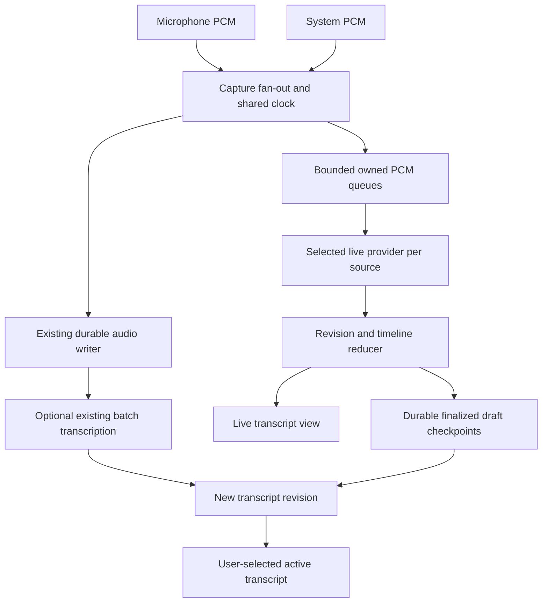

# Live transcription for Gday Meetings

Research date: 2026-09-25. Scope: implementation research, primarily for the native Swift client; no feature implementation or recognition benchmark was performed. Repository baseline inspected: `9b988ca`. Recommendations and numerical acceptance targets below are engineering proposals, not measured results.

## Recommendation

Build the first live transcription implementation around **Apple SpeechAnalyzer + SpeechTranscriber on supported macOS 26+ devices**, behind a provider boundary. Preserve macOS 14.2 as the app minimum and retain recording and post-recording transcription everywhere. Evaluate DictationTranscriber for unsupported hardware/locales on macOS 26+, and WhisperKit as the next optional offline provider for older Apple-silicon systems. Keep cloud streaming explicitly selectable.

Use live text as a durable draft; offer the existing server/WhisperX pipeline afterward for alignment and diarization. Do not silently replace an edited transcript. This gives the native client a useful first release without simultaneously building a streaming server, shipping a model stack, and solving live speaker identification.

Apple explicitly identifies SpeechAnalyzer as technology used by Voice Memos and Notes, and describes SpeechTranscriber as an on-device model for long-form and distant speech. This establishes a strong architectural fit, but does not prove identical application behavior or accuracy on our meeting audio. [Apple WWDC25](https://developer.apple.com/videos/play/wwdc2025/277/)

## What “like Voice Memos” means

Voice Memos on Mac supports transcription on Apple silicon with macOS 15+, including viewing text during recording and highlighting the current word. Availability varies by region. That application's OS requirement must not be confused with the public SpeechAnalyzer API, introduced in macOS 26. [Voice Memos guide](https://support.apple.com/en-qa/guide/voice-memos/vm4a03609f0d/mac), [SpeechTranscriber API metadata](https://developer.apple.com/tutorials/data/documentation/speech/speechtranscriber.json)

Our proposed experience:

- Start recording immediately; show whether live text is preparing, listening, unavailable, or interrupted.
- Show stable phrases followed by visibly provisional text that can change without duplicating previous words.
- Keep notes, recording controls, and source meters accessible. Follow the newest phrase until the user scrolls away; provide a “Follow live” action.
- Preserve text and its timeline when recording stops. Enable transcript-to-audio navigation; add word highlighting when actual timing data exists.
- Continue recording if recognition, a model download, or a network connection fails.

Meeting capture is harder than a single voice memo: local and remote speech can overlap, speakers can leak into the microphone, and system audio can contain several people. Source separation is useful evidence, not proof of speaker identity.

## Existing integration points

Paths below are relative to the repository root. Findings are from source inspection, not assumptions about the running app.

| Area | Current behavior | Implication |
| --- | --- | --- |
| [Package.swift](../apps/client-macos-swift/Package.swift) | macOS 14.2 minimum; Swift tools 5.9 manifest; native audio bridges | Gate modern Speech types behind availability checks; update build-tool documentation when adopting a newer SDK |
| [AudioCapture.swift](../apps/client-macos-swift/Sources/GdayMeetings/Core/AudioCapture.swift) | AVAudioEngine microphone tap; separate system callback; common host-clock epoch | Fan out owned PCM buffers and timestamps before compression |
| [SystemAudioCapture.swift](../apps/client-macos-swift/Sources/GdayMeetings/Core/SystemAudioCapture.swift) | Core Audio process tap, C ring buffer, consumer queue; reusable stereo PCM buffer | Keep inference and allocations out of the IOProc; copy before the consumer reuses its buffer |
| [TimedAudioWriter.swift](../apps/client-macos-swift/Sources/GdayMeetings/Core/TimedAudioWriter.swift) | Maps host time to frames; fills gaps and trims overlaps | Recognition must use the same mapping to remain aligned with saved audio |
| [MeetingStore.swift](../apps/client-macos-swift/Sources/GdayMeetings/Core/MeetingStore.swift) | Owns recording lifecycle; auto-transcription runs after stop | Add a separate live-session lifecycle and finalization state |
| [MeetingIntelligence.swift](../apps/client-macos-swift/Sources/GdayMeetings/Core/MeetingIntelligence.swift) | Direct file transcription, ten-minute excerpts, whole transcript replacement | This is a batch path; shortening excerpts alone will not create reliable streaming |
| [ServerTranscription.swift](../apps/client-macos-swift/Sources/GdayMeetings/Core/ServerTranscription.swift) | Durable upload/job checkpoints; replaces transcript on completion | Retain retry semantics; add revision-aware acceptance before combining with live drafts |
| [Models.swift](../apps/client-macos-swift/Sources/GdayMeetings/Core/Models.swift) | Segment ID, start/end, speaker, text; no word timing, revisions, or finality | Extend storage deliberately rather than treating each partial as a new segment |
| [RecordingWorkspaceView.swift](../apps/client-macos-swift/Sources/GdayMeetings/UI/RecordingWorkspaceView.swift) | Recording configuration/workspace | Add live text with synthetic preview events |
| [Worker](../apps/worker-audio-extraction/README.md) | File jobs; WhisperX/faster-whisper, alignment, pyannote diarization | Suitable for post-processing; no current continuous-audio transport |

The current Swift system capture uses Core Audio taps, not ScreenCaptureKit. Replacing capture is unnecessary for this feature. The Rust client can later reuse the event/storage contract, but needs its own provider integration; Swift framework integration is not automatically portable.

## Approaches considered

Relative effort includes packaging, lifecycle, and recovery, not just calling an inference API.

| Approach | Compatibility and execution | Main benefit | Main cost or limitation | Decision |
| --- | --- | --- | --- | --- |
| SpeechAnalyzer + SpeechTranscriber | macOS 26+; runtime device/locale checks; on-device | Native streaming and system-managed assets | Newer OS; must test two simultaneous sources | First implementation |
| DictationTranscriber | macOS 26+; older dictation models on-device | Additional hardware/locale coverage within the new API | Different quality profile; does not backport to macOS 14/15 | Capability fallback to evaluate |
| SFSpeechRecognizer | Available on our older OS baseline; local capability varies | Small native prototype | Short-session guidance, authorization, possible server dependence | Avoid as the primary meeting engine |
| WhisperKit | Swift/Core ML; Apple-silicon focus | Offline model choice and older-OS coverage | Model acquisition, warmup, resource tuning, evolving package | Preferred optional local alternative |
| whisper.cpp | C/C++; CPU and accelerated backends | Broad portability, including a potential shared Rust backend | Native build/bindings and streaming policy ownership | Consider if Intel/cross-platform becomes a priority |
| Hosted streaming ASR | Audio leaves the device; network required | Low local compute; provider-specific language/timing features | Usage charges, credentials, reconnects, service limits | Explicit opt-in alternative |
| Self-hosted streaming ASR | New persistent streaming service | Infrastructure/data control | Scheduling, warm models, transport, capacity and operations | Later if justified by deployment needs |
| Repeated short file jobs | Reuses much of current batch pipeline | Quick demonstration | Boundary errors, repeated compute, queue latency | Prototype only |

### Apple SpeechAnalyzer: recommended first path

Use `SpeechTranscriber.isAvailable` and `supportedLocale(equivalentTo:)`; do not assume that OS version, CPU architecture, or a manually constructed locale string guarantees support. `DictationTranscriber` uses on-device dictation models and does not provide locales that the older recognizer supports only over a network. Both modern transcribers require macOS 26. [SpeechTranscriber](https://developer.apple.com/documentation/speech/speechtranscriber), [DictationTranscriber](https://developer.apple.com/documentation/speech/dictationtranscriber)

Model readiness is a product state. `AssetInventory` manages shared downloads and a bounded set of locale reservations. Obtain an installation request for the configured modules, download/install when needed, and handle unavailable storage, cancellation, offline first use, and previously removed assets. Release obsolete locale reservations when preferences change, rather than repeatedly churning them per audio buffer. [AssetInventory](https://developer.apple.com/documentation/speech/assetinventory)

The analyzer accepts asynchronous PCM input; transcription results arrive separately. Choose a compatible format with `bestAvailableAudioFormat`, convert with a persistent converter, and finish analysis explicitly. Ending an input stream alone does not generally finish the analyzer. One analyzer consumes one input sequence; simultaneous analysis is resource-limited. [SpeechAnalyzer](https://developer.apple.com/documentation/speech/speechanalyzer)

Enable volatile results and audio time-range attributes, or the corresponding time-indexed progressive preset. Results can revise a phrase before it becomes final. Preserve attributed timing runs alongside plain text; a display word is not necessarily identical to an attributed-string run. [Result](https://developer.apple.com/documentation/speech/speechtranscriber/result), [Apple sample](https://developer.apple.com/documentation/speech/bringing-advanced-speech-to-text-capabilities-to-your-app)

Proposed integration sequence:

1. Resolve capabilities and model readiness before the session where possible. Offer recording even if live text cannot start.
2. Create one provider session per enabled source, beginning with a one-source spike, then verify two analyzers under load. Do not override resource limits to force the feature on.
3. Copy buffers into bounded owned storage. On a worker task, convert to the analyzer format and assign input times from the recording epoch.
4. Consume provider results into the reducer described below. UI work runs on the main actor; inference does not.
5. Stop capture, drain queued audio, finish the input sequence, call `finalizeAndFinishThroughEndOfInput()`, await result completion, and checkpoint. Apply a timeout; retain incomplete status if finalization fails.

Build with an SDK containing these symbols, use `@available(macOS 26.0, *)` and guarded construction, and launch-test the same binary on macOS 14.2/15. A runtime availability check cannot make an old SDK compile unknown types. The installed Speech module interface confirms the above symbols; newer documentation also describes helper APIs, so verify each helper's own introduction version before using it in the macOS 26 path.

### Older Apple recognizer: a constrained fallback

`SFSpeechAudioBufferRecognitionRequest` can consume PCM and report partials. Apple still documents planning for roughly one-minute recognition tasks and service throttling; locale support may require a network. This is poor default behavior for an hour-long meeting. The currently fetched class metadata does **not** mark SFSpeechRecognizer deprecated: it is a legacy design tradeoff, not an asserted compiler deprecation. [SFSpeechRecognizer](https://developer.apple.com/documentation/speech/sfspeechrecognizer)

If deliberately implemented, check on-device support, require local recognition for an offline setting, and never silently switch to remote processing. Use the speech authorization flow and appropriate purpose string in addition to existing capture permissions. Rolling requests would need overlap, timestamp rebasing, deduplication, cancellation, and recovery tests; observed longer local sessions are not a replacement for a supported duration contract. [On-device requirement](https://developer.apple.com/documentation/speech/sfspeechrecognitionrequest/requiresondevicerecognition), [Speech purpose string](https://developer.apple.com/documentation/bundleresources/information-property-list/nsspeechrecognitionusagedescription)

### Local Whisper: control in exchange for model ownership

WhisperKit now lives in Argmax's `argmax-oss-swift` repository. Its open-source CLI documents microphone streaming, while its HTTP file endpoint and commercial Pro streaming products are separate capabilities. Do not assume a Pro demonstration describes the open-source implementation. The inspected package manifest declares macOS 13 and Swift tools 5.10; pin a release and verify its actual product requirements before integration. [Project](https://github.com/argmaxinc/argmax-oss-swift), [Manifest](https://github.com/argmaxinc/argmax-oss-swift/blob/main/Package.swift), [Pro streaming documentation](https://app.argmaxinc.com/docs/examples/real-time-transcription)

For our client, inject captured samples instead of starting the library's microphone recorder. Budget download size, cache integrity, compilation/warmup, memory, battery, and two-source throughput. Persist the chosen model/version for reproducibility. Prefer an optional download over bundling large weights into every installation. Benchmark small and larger multilingual models on our own corpus before selecting one.

whisper.cpp provides native inference and CPU/Metal support, but its microphone stream example is a simple periodically evaluated window. It is a useful starting point, not a finished meeting transcript lifecycle. [whisper.cpp](https://github.com/ggml-org/whisper.cpp), [Stream example](https://github.com/ggml-org/whisper.cpp/blob/master/examples/stream/README.md)

For either backend, repeated windows need a stability policy: align overlapping hypotheses, commit their agreed prefix, and keep the tail revisable. Limit contextual history and trim confirmed audio so memory and repeated inference do not grow with meeting length. VAD can reduce silence work, but should not clip quiet speech. The Whisper-Streaming authors demonstrate local agreement and now direct users to SimulStreaming; their published latency is benchmark-specific, not a Gday guarantee. [Whisper-Streaming](https://github.com/ufal/whisper_streaming), [SimulStreaming](https://github.com/ufal/SimulStreaming)

### Hosted streaming: useful, but a new provider contract

OpenAI's current guide recommends a transcription session with `gpt-live-transcribe`, incremental/completed events, and application commits. Its documented PCM example uses 24 kHz. That model uses client-side turn detection rather than `server_vad`/`semantic_vad`; completion events across turns are not guaranteed to arrive in order. It does not provide word timestamps or diarization. Track item IDs and application audio ranges. Recheck these model-specific details before implementation instead of copying older Realtime examples. [Realtime transcription](https://developers.openai.com/api/docs/guides/realtime-transcription)

Deepgram offers interim text plus distinct segment-final and speech-end indicators. These represent different boundaries and should map separately into our provider events. Its multichannel API can transcribe channels independently; construct correctly synchronized source channels rather than assuming a stereo system mix already means two speakers. [Endpointing](https://developers.deepgram.com/docs/understand-endpointing-interim-results), [Multichannel](https://developers.deepgram.com/docs/multichannel)

Proposed cloud design: start with one adapter, explicit transmission consent/settings, and either a user's Keychain-held credential or a server-brokered short-lived credential. Never embed an application-wide secret in the app. The server must check meeting ownership and usage limits before brokering or proxying. Use bounded reconnect/backoff, sequence numbers, a confirmed-audio watermark, and gap markers. Replaying uncertain audio can duplicate billing and results; reconcile by source/session/time rather than text alone. Provider retention and residency settings must be checked for the chosen account before describing this mode as private.

Do not claim our existing “OpenAI-compatible” file URL supports streaming. File response streaming and ongoing audio ingestion are different protocols. [File transcription guide](https://developers.openai.com/api/docs/guides/speech-to-text)

### Self-hosted streaming and repeated file chunks

Our worker accepts complete file jobs and serializes local inference. Adding a WebSocket route alone would leave model scheduling, incremental state, fairness, cancellation, and result durability unsolved. A streaming service should keep models warm, authenticate per meeting, bound each session, and publish typed events through the server. Keep final alignment/diarization in a separate queue so they cannot stall active meetings. SimulStreaming is a candidate to evaluate, not a drop-in replacement for the worker's WhisperX contract.

Short overlapping uploads are acceptable for a disposable experiment. For a window of length W submitted every S seconds, repeated audio approaches W/S times the original duration: a 10-second window every 2 seconds is approximately five times the audio work before retries. That can multiply provider charges and local compute. Non-overlapping chunks avoid that multiplier but lose boundary context; neither solves partial-result reconciliation automatically.

## Proposed architecture and data contract

This is a proposed boundary, not a new dependency requirement. A provider exposes readiness, supported locales, timing granularity, incremental capability, and local/remote execution. It accepts audio envelopes containing recording ID, source ID, sequence, format, first-frame time, and owned PCM; it emits replacement/finalization events, recoverable gaps, or failures.

Use a session generation to reject results from a previous recording or restarted provider. An event should identify its source/session, provider item or range, revision, text, finality, and available timings. Normalize provider-specific semantics inside adapters. Replacement updates must not append repeated hypotheses. A final phrase from one source must not clear the other source's provisional text.

Timing rules:

- Express persisted times relative to the capture epoch, not callback arrival time or `Date()`.
- Keep source offsets through resampling. Account for conversion buffering; do not reset sample counts per callback.
- Match the writer's gap/overlap decisions or send explicit discontinuity times. Never concatenate separated audio and then pretend it was continuous.
- Sort across sources by audio time with deterministic tie-breaking. Recognition completion order is not conversation order.
- Store word timing only when supported. Application turn boundaries are coarse estimates, not word alignment.

Backpressure is a correctness issue. Start with a bounded queue sized in seconds and profile it; do not use an unbounded AsyncStream or create a Task for every buffer. On saturation, preserve recording, mark the skipped recognition interval, and offer later repair from saved audio. Do not invoke AudioCapture's recording-failure callback for an ASR-only failure. ASR startup should not hold the recording controls hostage to a download.

For two-source capture, prefer independent recognition when resources permit; label text “Microphone” and “System audio” initially. A single mixed ASR stream is a possible lower-resource mode but loses source attribution and makes overlap harder. Do not silently downshift. Test external speaker leakage with headphones and speakers; the existing voice-processing option does not guarantee cancellation of every external app's audio. Avoid removing repeated phrases solely because their text matches.

Persist finalized live phrases in a versioned per-meeting journal/checkpoint, with source, engine/model/locale, coverage, and completion status. Keep volatile text in memory. Atomically checkpoint and bound journal growth; on recovery, retain confirmed text and identify unprocessed audio ranges. Store user edits separately from provider revisions or create immutable transcript revisions with an active revision pointer. Backward-compatible decoding and export behavior need tests.

The current batch completion code assigns `meeting.transcript` wholesale. Before enabling automatic post-processing alongside live drafts, change this to produce a new revision and preserve edits. A provider's “final” means stable within that recognition session, not a verified meeting record. Summaries/search should use the selected stable revision and should not be regenerated on every partial token.

## Delivery plan and decision gates

| Stage | Deliverable | Exit evidence |
| --- | --- | --- |
| 1. Capability spike | Apple model readiness, one PCM source, provisional/final reducer, timestamp export | Real speech, offline after provisioning, final words preserved at stop |
| 2. Capture integration | Existing microphone/system fan-out, two sessions, bounded queues | 60–120 minute capture without ASR-induced recording loss; synchronization and resource measurements |
| 3. Product behavior | Live workspace, error states, checkpoints, recovery, transcript revision policy | Crash/stop/error scenarios, user edits preserved, synthetic UI Preview validated |
| 4. Compatibility | macOS 14.2/15 feature gating, DictationTranscriber evaluation, optional WhisperKit spike | Actual oldest-OS launch and architecture matrix; no silently remote fallback |
| 5. Optional remote mode | One cloud adapter or a separately justified self-hosted service | Account capability, measured latency/cost, reconnect/duplicate tests |

Planning estimate for one maintainer: 2–4 days for the Apple spike, then roughly 1–2 weeks for capture/lifecycle/storage/UI hardening, with compatibility or a second provider adding further work. These are rough engineering estimates; re-estimate after the two-source and stop/finalization experiments. Do not commit to all providers in the initial release.

Suggested routing: supported macOS 26+ device/locale → SpeechTranscriber; otherwise evaluate an available local DictationTranscriber on that OS; otherwise use an explicitly installed/selected local model or explicitly enabled cloud provider. With neither, recording and batch transcription remain available. Never interpret “automatic” as permission to upload audio.

## Evaluation and operating costs

Create a consented, manually checked evaluation corpus containing Australian English, accents, names/numbers, quiet and noisy rooms, remote compressed audio, overlapping speakers, silence/music, and Chinese/mixed-language speech if those are intended product requirements. Run the same timestamped PCM through providers at wall-clock pace; faster-than-realtime file tests cannot establish live latency.

Suggested initial targets, subject to the spike:

| Metric | How to measure | Proposed gate |
| --- | --- | --- |
| First useful partial | Audio word/phrase time to visible text, warmed model | p95 ≤ 2 seconds |
| Stable phrase latency | End of utterance to final result | p95 ≤ 5 seconds |
| Capture integrity | Compare captured frame/gap counters with ASR off/on | No additional unexplained audio loss |
| Sustained throughput | Queue age plus inference time / audio duration | Bounded queue over 60–120 minutes; no accumulating delay |
| Text accuracy | WER for space-separated text; CER where appropriate; named-entity errors | Compare against existing batch output and human references; set numerical gate after baseline |
| Timeline | Known audible markers and transcript seek checks | Segment offsets within 250 ms on controlled fixtures; evaluate word times separately |
| Resource use | App and speech-service CPU/memory, energy, thermal state | Bounded growth and usable concurrent meeting app |
| Recovery | Provider death, network loss, disk failure, sleep/route change, app restart | Audio preserved where capture succeeds; gaps visible; no duplicated finals or lost edits |

Also test denied microphone/system permission, first-run download cancellation, unsupported locale, model eviction, provider quota errors, rapid Start/Stop, stopping mid-word, and one source remaining silent. The current capture deliberately saves a partial meeting on route changes; live transcription should finalize that same partial session rather than invent transparent recording recovery.

Apple avoids a separately contracted metered ASR service, but local inference still consumes device resources and model storage. Whisper variants add model delivery/support overhead. Cloud costs depend on actual billable audio/channels, retries, model, account plan, and any final batch pass; do not budget only wall-clock meeting duration. At a hypothetical rate r per audio minute, a 60-minute meeting sent as two continuously billed streams costs 120r before retry/post-processing costs. This is a formula, not a provider quote. Capture actual usage from a pilot before choosing a paid default. Self-hosting must include idle warm capacity and operational time, not just inference seconds.

## Open questions and limits of this research

- No live recognition was run, no model was downloaded, and no meeting audio was sent to a provider. Accuracy, real latency, Apple two-session capacity, and battery impact remain unmeasured.
- Supported locales and device readiness must be queried at runtime; documentation language lists are not recognition-language lists.
- Verify permissions for the selected modern Speech path in the packaged app. Existing microphone/system purpose strings are present; an SFSpeechRecognizer adapter would require its own speech authorization setup. Do not add unrelated screen-capture permissions.
- Check the chosen release's SDK availability and compiler diagnostics during implementation. This documentation change generated no build diagnostics; it does not certify the application warning-free.
- The current Swift segment schema cannot preserve word timings or alternative transcript revisions. Address that before claiming full Voice Memos-like playback highlighting or safe post-processing.
- The most consequential first experiment is two-source, long-duration Apple recognition on the lowest supported device for that mode. If it fails the latency/resource gate, prefer an explicit one-source mode or another provider instead of weakening recording reliability.
