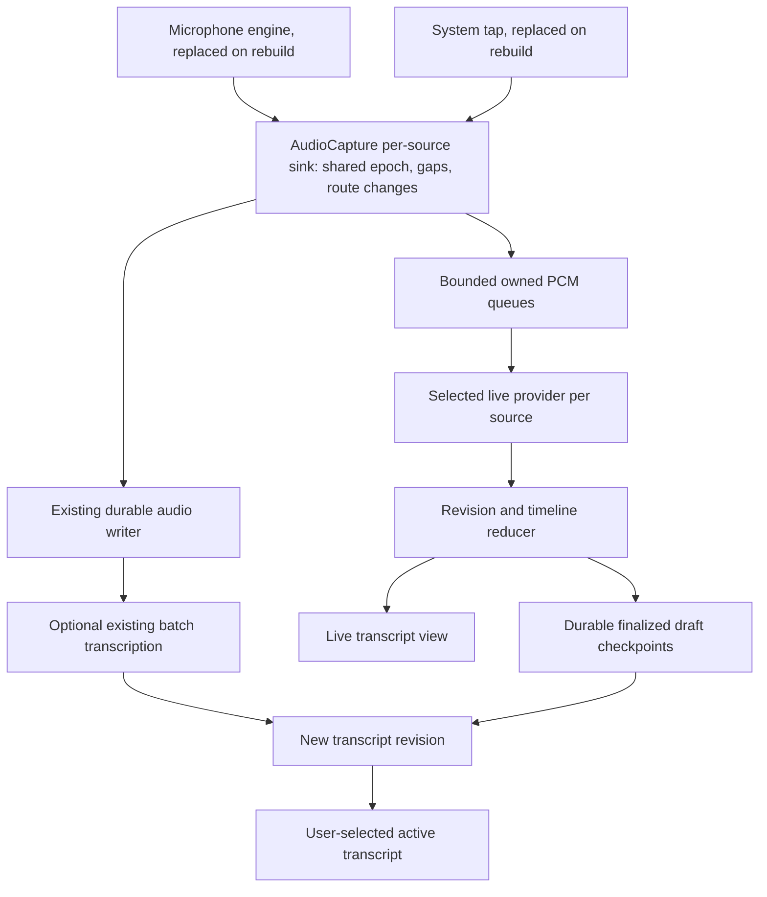

# Live transcription for Gday Meetings

Research date: 2026-09-25, against repository baseline `9b988ca`. Architecture audit: 2026-09-26, against `169ce49`; repository facts below reflect that commit, and external provider research was not repeated. Scope: implementation research, primarily for the native Swift client; no feature implementation or recognition benchmark was performed. Recommendations and numerical acceptance targets below are engineering proposals, not measured results.

## Recommendation

**Good English and Chinese transcription is a minimum product requirement.** Start with an Apple SpeechAnalyzer + SpeechTranscriber spike on supported macOS 26+ devices, but make the default-provider decision conditional on English, Mandarin, and English–Mandarin mixed-speech evaluation. Compare a multilingual WhisperKit model in the same initial evaluation, rather than deferring it solely to older-OS compatibility. Preserve macOS 14.2 as the app minimum and retain recording and post-recording transcription everywhere. Evaluate DictationTranscriber for unsupported hardware/locales on macOS 26+. Keep cloud streaming explicitly selectable.

Use live text as a durable draft; offer the existing server/WhisperX pipeline afterward for alignment and diarization. Do not silently replace an edited transcript. This gives the native client a useful first release without simultaneously building a streaming server, shipping a model stack, and solving live speaker identification.

Apple explicitly identifies SpeechAnalyzer as technology used by Voice Memos and Notes, and describes SpeechTranscriber as an on-device model for long-form and distant speech. This establishes a strong architectural fit, but does not prove identical application behavior or accuracy on our meeting audio. [Apple WWDC25](https://developer.apple.com/videos/play/wwdc2025/277/)

## What “like Voice Memos” means

Voice Memos on Mac supports transcription on Apple silicon with macOS 15+, including viewing text during recording and highlighting the current word. Availability varies by region. That application's OS requirement must not be confused with the public SpeechAnalyzer API, introduced in macOS 26. [Voice Memos guide](https://support.apple.com/en-qa/guide/voice-memos/vm4a03609f0d/mac), [SpeechTranscriber API metadata](https://developer.apple.com/tutorials/data/documentation/speech/speechtranscriber.json)

Our proposed experience:

- Start recording immediately; show in the recording view whether live text is preparing, listening, unavailable, or interrupted.
- Show stable phrases followed by visibly provisional text that can change without duplicating previous words.
- Keep notes, recording controls, and source meters accessible. Follow the newest phrase until the user scrolls away; provide a “Follow live” action.
- Preserve text and its timeline when recording stops. Enable transcript-to-audio navigation; add word highlighting when actual timing data exists.
- Continue recording if recognition, a model download, or a network connection fails.

Meeting capture differs from a single voice memo. Microphone and system audio are separate, time-aligned tracks, so when a local and a remote person talk at once, each voice goes to its own recognizer rather than one mixed signal. Two problems remain:

- Several remote participants share the single system-audio track and can overlap within it.
- Speaker playback can leak into the microphone. Headphones avoid this path. With **Settings → Recording → Turn On Voice Processing Automatically** on (the default), Apple voice processing turns on for a speaker output, or when echo detection finds system audio in the microphone. Voice processing reduces leakage but does not guarantee its removal, and it can be switched off during recording.

Source separation is useful evidence, not proof of speaker identity.

## English and Chinese are release requirements

The user explicitly requires good English and Chinese support. For planning, use Mandarin as the initial Chinese speech baseline; assess Cantonese separately rather than implying that a generic “Chinese” label guarantees it. This is a scope assumption, not a confirmed exclusion of Cantonese. Include Australian English and Chinese-accented English. Treat Simplified/Traditional as an output preference distinct from the spoken language or dialect.

Proposed meeting modes are **English**, **Chinese (Mandarin)**, and **English + Chinese**. Mixed mode must preserve both languages, including English names and technical terms inside Chinese sentences; it must not translate speech into English. Keep transcription and optional translation as separate artifacts. Test utterance-to-utterance switches and switches within a sentence. “Automatic language detection” is not evidence that either case works reliably.

| Candidate | Evidence and uncertainty | Decision consequence |
| --- | --- | --- |
| Apple SpeechTranscriber / DictationTranscriber | SpeechTranscriber initialization takes one locale; query actual runtime support. A locale list does not establish mixed-language quality. | Test English and Mandarin configurations on the same bilingual fixtures. Do not promise automatic bilingual recognition from API availability alone. |
| WhisperKit / whisper.cpp | Whisper has distinct English-only and multilingual weights; quality varies by language. | Use multilingual weights, never an `.en` model for the shared default. Compare a smaller model against a large-v3-class candidate where supported; test mixed speech and thermal cost. |
| OpenAI live transcription | The current API accepts multiple expected-language hints and documents Mandarin/Cantonese and regional Chinese codes. | Evaluate `languages: ["en", "zh-cn"]` for the Mandarin trial, then validate the selected account/model accepts it. Hints do not establish accuracy or output-script guarantees. |
| Deepgram Nova-3 | Current documentation lists English, Mandarin Simplified/Traditional, and Cantonese separately; its documented `multi` language set does not include Chinese. | A candidate for explicit-language English/Chinese modes; do not qualify it for mixed English–Chinese solely because both languages appear in the overall language list. |

Sources: [Apple transcriber](https://developer.apple.com/documentation/speech/speechtranscriber), [Whisper models and language variation](https://github.com/openai/whisper), [OpenAI language hints](https://developers.openai.com/api/docs/guides/realtime-transcription), [Deepgram language matrix](https://developers.deepgram.com/docs/models-languages-overview), [Deepgram code-switching](https://developers.deepgram.com/docs/multilingual-code-switching). These document capabilities, not comparative quality on our meetings.

Do not route short audio fragments between English and Chinese engines based on a noisy language guess: switching can lose context and duplicate or omit boundary words. First evaluate a single multilingual engine per source. If an Apple language change requires a replacement session, finalize/restart at a deliberate boundary with a timestamped handoff. Running two language recognizers for each of two audio sources means four sessions and competing hypotheses; it is an experiment requiring a reconciliation policy and resource testing, not a free fallback.

### Existing language behavior that must change

Each Swift meeting stores one language code, chosen in New Recording or meeting details and initialized from **Settings → Recording → Default Language** (initially English, `en`). The choices come from the selected transcription provider's reported catalog; the app has no fallback catalog and rejects empty or `auto` values before upload. Each transcription attempt snapshots the code. One code carries both spoken language and preferred script (`zh-cn` and `zh-tw` select output conversion), and there is no list of expected languages. The worker accepts one job-level language, strips regional suffixes for WhisperX, and applies OpenCC conversion for exact `zh-cn`/`zh-tw` inputs. Its pipeline aligns each track using the transcription result's single language. These are useful batch building blocks, but neither script conversion nor that alignment path proves bilingual recognition/alignment. [Swift submission](../apps/client-macos-swift/Sources/GdayMeetings/Core/ProviderTranscription.swift), [Language discovery](protocols/transcription.md#discover-supported-languages), [Worker language handling](../apps/worker-audio-extraction/src/audio_extraction/handler.py), [Worker alignment](../apps/worker-audio-extraction/src/audio_extraction/pipeline.py)

Add separate persisted fields for expected spoken languages, optional dialect/locale, preferred script, and the provider's actual configuration. Map these through each adapter rather than passing one provider's language codes unchanged everywhere; a live engine's supported locales are not the batch provider's catalog. Preserve raw recognized text alongside any display conversion. Conversion can alter character counts and phrases, so retain explicit mappings for timing/edit offsets; do not attach old character offsets blindly to converted text. For mixed-language batch alignment, evaluate per-span alignment or preserve coarser trustworthy timing when an aligner cannot represent a span. Missing alignment must not delete correctly recognized text.

### What “good” must demonstrate

Use independently reviewed reference transcripts from English-only, Mandarin-only, and mixed meetings, including names, dates, amounts, acronyms, Chinese punctuation, regional accents, remote-call compression, and overlaps. Keep a separate Cantonese set and report its status honestly. Suggested initial quality targets on clear meeting audio are English WER ≤ 10%, Mandarin CER ≤ 10%, and mixed error rate ≤ 15%, with ≥ 95% exact accuracy on annotated important names/numbers. These are proposed acceptance thresholds, not measured capabilities; review their suitability after the corpus baseline rather than weakening them implicitly to fit a provider.

For mixed error rate, specify tokenization as individual Han characters plus English word tokens, and publish normalization rules. Report raw and script-normalized Chinese CER so character conversion does not conceal recognition errors. Score language slices separately, along with omitted spans, unintended translation, and latency around switch points. An overall average must not conceal poor Chinese results behind a larger English sample. Use the same recording and latency gates for all three primary modes.

Select the default only after both language slices pass. If Apple passes monolingual modes but fails mixed speech, route mixed mode to a validated multilingual local engine or an explicitly selected cloud engine. If none passes, label the limitation and keep recording available; post-meeting repair does not satisfy the live bilingual requirement.

## Existing integration points

Findings are from source inspection at `169ce49`, not from running the app.

| Area | Current behavior | Implication |
| --- | --- | --- |
| [Package.swift](../apps/client-macos-swift/Package.swift) | macOS 14.2 minimum; Swift tools 5.9 manifest; native audio bridges | Gate modern Speech types behind availability checks; update build-tool documentation when adopting a newer SDK |
| [AudioCapture.swift](../apps/client-macos-swift/Sources/GdayMeetings/Core/AudioCapture.swift) | Owns both track writers, one host-clock epoch for the whole recording, and a recovery controller per source. Rebuilds the microphone engine or system tap after route, format, or device changes, a missing timestamp, or 3 seconds without buffers; the other source keeps recording. Each microphone build pins a selected microphone and applies the voice-processing policy (automatic, live switch, or echo-triggered). Records each route change. `onFailure` fires only for writer errors or when every selected source has failed. | Put the recognition fan-out here, in a per-source sink that outlives capture sessions: each session's tap closure is discarded on rebuild. Forward reconnect, format, and voice-processing changes as discontinuity events. ASR errors must not reach `onFailure`. |
| [CaptureSourceRecovery.swift](../apps/client-macos-swift/Sources/GdayMeetings/Core/CaptureSourceRecovery.swift) | Running, reconnecting, failed, and stopped states per source; a generation per rebuild request; debounce and capped backoff; stop with a deadline that abandons a stuck native call | A capture generation identifies a device session, not a recognition session. A rebuild should add a discontinuity, not end live text. Do not make ASR finalization wait on an abandoned attempt. |
| [SystemAudioCapture.swift](../apps/client-macos-swift/Sources/GdayMeetings/Core/SystemAudioCapture.swift) | Core Audio process tap, C ring buffer, consumer queue; one reusable stereo Float32 buffer. One instance per tap session: format, aggregate, or ring failures report an interruption and recovery replaces the instance. | Keep inference and allocations out of the IOProc; copy before the consumer reuses its buffer. The sample rate can differ after a rebuild. |
| [TimedAudioWriter.swift](../apps/client-macos-swift/Sources/GdayMeetings/Core/TimedAudioWriter.swift) | Fixes each track's format at its first device; maps channels and resamples later formats into it. Maps host time to frames, pads missing intervals with silence, trims overlaps, and records gaps of 0.1 seconds or longer. | Its converted output has one format and the saved file's frame positions, which makes it the simplest recognition input. It is not exposed today. A hook would run under the writer lock on capture threads, so it must copy into a bounded queue without blocking. |
| [EchoDetector.swift](../apps/client-macos-swift/Sources/GdayMeetings/Core/EchoDetector.swift) | Correlates 20 ms level envelopes of microphone and system audio over 6 seconds at 0–400 ms lags, once per second. Runs only while both sources record and the microphone is unprocessed. Under the automatic policy, a report turns voice processing on; only the live switch turns it off again. | Makes leakage less likely to reach the microphone recognizer, without guaranteeing it. It stops evaluating once processing is on, so it does not measure residual echo. |
| [RecordingAudioRoute.swift](../apps/client-macos-swift/Sources/GdayMeetings/Core/RecordingAudioRoute.swift) | Classifies the default output's terminal type: speakers turn automatic voice processing on; headphones and unknown routes leave it off. Lists input devices for the Microphone menu. | Describes the Mac's default output, not a calling app's own output choice. Expected leakage in a given recording remains uncertain. |
| [MeetingStore.swift](../apps/client-macos-swift/Sources/GdayMeetings/Core/MeetingStore.swift) | Owns the recording lifecycle and saves the recording profile, including gaps and route changes, at start and stop. After a successful stop, transcribes only when **Automatically Transcribe Recordings** is on (off by default). `isBusy` and `statusMessage` drive a progress bar that is hidden while recording; failures appear as alerts through `errorMessage`. | Add a separate live-session lifecycle and finalization state. Do not use `isBusy` or `statusMessage` for live text: `isBusy` disables other actions and the bar is hidden during recording. Use alerts only for failures that need action. |
| [MeetingIntelligence.swift](../apps/client-macos-swift/Sources/GdayMeetings/Core/MeetingIntelligence.swift) | Resolves the meeting's transcription provider (RunPod with Filedrop, or the Gday Meetings website) and the summary provider. The OpenAI-compatible provider handles summaries only. | Add a separate streaming capability and contract; no current provider streams. |
| [ProviderTranscription.swift](../apps/client-macos-swift/Sources/GdayMeetings/Core/ProviderTranscription.swift) | Durable provider/upload/job checkpoints; language snapshot validated against the provider's catalog; per-track microphone/system source type; preserves transcript edits and retains conflicting results | Retain retry semantics; extend revision handling before combining with live drafts |
| [Models.swift](../apps/client-macos-swift/Sources/GdayMeetings/Core/Models.swift) | Segment ID, start/end, speaker, text; one language code per meeting; no word timing, revisions, or finality | Extend storage deliberately rather than treating each partial as a new segment |
| [RecordingWorkspaceView.swift](../apps/client-macos-swift/Sources/GdayMeetings/UI/RecordingWorkspaceView.swift) | New Recording setup (title, language, sources, Microphone menu) and the live view: reconnect status, source meters, and the **Voice Processing** switch with its notices | Add live text with synthetic preview events; keep recognition state separate from capture reconnect status |
| [Worker](../apps/worker-audio-extraction/README.md) | File jobs; WhisperX/faster-whisper, alignment, pyannote diarization | Suitable for post-processing; no current continuous-audio transport |

The current Swift system capture uses Core Audio taps, not ScreenCaptureKit. Replacing capture is unnecessary for this feature. The Rust client can later reuse the event/storage contract, but needs its own provider integration; Swift framework integration is not automatically portable.

## Approaches considered

Relative effort includes packaging, lifecycle, and recovery, not just calling an inference API.

| Approach | Compatibility and execution | Main benefit | Main cost or limitation | Decision |
| --- | --- | --- | --- | --- |
| SpeechAnalyzer + SpeechTranscriber | macOS 26+; runtime device/locale checks; on-device | Native streaming and system-managed assets | Newer OS; must test two simultaneous sources and bilingual quality | First spike; conditional default |
| DictationTranscriber | macOS 26+; older dictation models on-device | Additional hardware/locale coverage within the new API | Different quality profile; does not backport to macOS 14/15 | Capability fallback to evaluate |
| SFSpeechRecognizer | Available on our older OS baseline; local capability varies | Small native prototype | Short-session guidance, authorization, possible server dependence | Avoid as the primary meeting engine |
| WhisperKit | Swift/Core ML; Apple-silicon focus | Offline model choice and older-OS coverage | Model acquisition, warmup, resource tuning, evolving package | Preferred optional local alternative |
| whisper.cpp | C/C++; CPU and accelerated backends | Broad portability, including a potential shared Rust backend | Native build/bindings and streaming policy ownership | Consider if Intel/cross-platform becomes a priority |
| Hosted streaming ASR | Audio leaves the device; network required | Low local compute; provider-specific language/timing features | Usage charges, credentials, reconnects, service limits | Explicit opt-in alternative |
| Self-hosted streaming ASR | New persistent streaming service | Infrastructure/data control | Scheduling, warm models, transport, capacity and operations | Later if justified by deployment needs |
| Repeated short file jobs | Reuses much of current batch pipeline | Quick demonstration | Boundary errors, repeated compute, queue latency | Prototype only |

### Apple SpeechAnalyzer: recommended first path

Use `SpeechTranscriber.isAvailable` and `supportedLocale(equivalentTo:)`; do not assume that OS version, CPU architecture, or a manually constructed locale string guarantees support. `DictationTranscriber` uses on-device dictation models and does not provide locales that the older recognizer supports only over a network. Both modern transcribers require macOS 26. [SpeechTranscriber](https://developer.apple.com/documentation/speech/speechtranscriber), [DictationTranscriber](https://developer.apple.com/documentation/speech/dictationtranscriber)

Model readiness is a product state. `AssetInventory` manages shared downloads and a bounded set of locale reservations. Obtain an installation request for the configured modules, download/install when needed, and handle unavailable storage, cancellation, offline first use, and previously removed assets. Release obsolete locale reservations when preferences change, rather than repeatedly churning them per audio buffer. [AssetInventory](https://developer.apple.com/documentation/speech/assetinventory)

The analyzer accepts asynchronous PCM input; transcription results arrive separately. Choose a compatible format with `bestAvailableAudioFormat`, convert with a persistent converter, and finish analysis explicitly. Ending an input stream alone does not generally finish the analyzer. One analyzer consumes one input sequence; simultaneous analysis is resource-limited. [SpeechAnalyzer](https://developer.apple.com/documentation/speech/speechanalyzer)

Enable volatile results and audio time-range attributes, or the corresponding time-indexed progressive preset. Results can revise a phrase before it becomes final. Preserve attributed timing runs alongside plain text; a display word is not necessarily identical to an attributed-string run. [Result](https://developer.apple.com/documentation/speech/speechtranscriber/result), [Apple sample](https://developer.apple.com/documentation/speech/bringing-advanced-speech-to-text-capabilities-to-your-app)

Proposed integration sequence:

1. Resolve capabilities and model readiness before the session where possible. Offer recording even if live text cannot start.
2. Create one provider session per enabled source, beginning with a one-source spike, then verify two analyzers under load. Do not override resource limits to force the feature on.
3. Copy buffers into bounded owned storage. On a worker task, convert to the analyzer format and assign input times from the recording epoch.
4. Consume provider results into the reducer described below. UI work runs on the main actor; inference does not.
5. Stop capture, drain queued audio, finish the input sequence, call `finalizeAndFinishThroughEndOfInput()`, await result completion, and checkpoint. Apply a timeout; retain incomplete status if finalization fails.

Build with an SDK containing these symbols, use `@available(macOS 26.0, *)` and guarded construction, and launch-test the same binary on macOS 14.2/15. A runtime availability check cannot make an old SDK compile unknown types. The installed Speech module interface confirms the above symbols; newer documentation also describes helper APIs, so verify each helper's own introduction version before using it in the macOS 26 path.

### Older Apple recognizer: a constrained fallback

`SFSpeechAudioBufferRecognitionRequest` can consume PCM and report partials. Apple still documents planning for roughly one-minute recognition tasks and service throttling; locale support may require a network. This is poor default behavior for an hour-long meeting. The currently fetched class metadata does **not** mark SFSpeechRecognizer deprecated: it is a legacy design tradeoff, not an asserted compiler deprecation. [SFSpeechRecognizer](https://developer.apple.com/documentation/speech/sfspeechrecognizer)

If deliberately implemented, check on-device support, require local recognition for an offline setting, and never silently switch to remote processing. Use the speech authorization flow and appropriate purpose string in addition to existing capture permissions. Rolling requests would need overlap, timestamp rebasing, deduplication, cancellation, and recovery tests; observed longer local sessions are not a replacement for a supported duration contract. [On-device requirement](https://developer.apple.com/documentation/speech/sfspeechrecognitionrequest/requiresondevicerecognition), [Speech purpose string](https://developer.apple.com/documentation/bundleresources/information-property-list/nsspeechrecognitionusagedescription)

### Local Whisper: control in exchange for model ownership

WhisperKit now lives in Argmax's `argmax-oss-swift` repository. Its open-source CLI documents microphone streaming, while its HTTP file endpoint and commercial Pro streaming products are separate capabilities. Do not assume a Pro demonstration describes the open-source implementation. The inspected package manifest declares macOS 13 and Swift tools 5.10; pin a release and verify its actual product requirements before integration. [Project](https://github.com/argmaxinc/argmax-oss-swift), [Manifest](https://github.com/argmaxinc/argmax-oss-swift/blob/main/Package.swift), [Pro streaming documentation](https://app.argmaxinc.com/docs/examples/real-time-transcription)

For our client, inject captured samples instead of starting the library's microphone recorder. Budget download size, cache integrity, compilation/warmup, memory, battery, and two-source throughput. Persist the chosen model/version for reproducibility. Prefer an optional download over bundling large weights into every installation. Benchmark small and larger multilingual models on our own corpus before selecting one.

whisper.cpp provides native inference and CPU/Metal support, but its microphone stream example is a simple periodically evaluated window. It is a useful starting point, not a finished meeting transcript lifecycle. [whisper.cpp](https://github.com/ggml-org/whisper.cpp), [Stream example](https://github.com/ggml-org/whisper.cpp/blob/master/examples/stream/README.md)

For either backend, repeated windows need a stability policy: align overlapping hypotheses, commit their agreed prefix, and keep the tail revisable. Limit contextual history and trim confirmed audio so memory and repeated inference do not grow with meeting length. VAD can reduce silence work, but should not clip quiet speech. The Whisper-Streaming authors demonstrate local agreement and now direct users to SimulStreaming; their published latency is benchmark-specific, not a Gday guarantee. [Whisper-Streaming](https://github.com/ufal/whisper_streaming), [SimulStreaming](https://github.com/ufal/SimulStreaming)

### Hosted streaming: useful, but a new provider contract

OpenAI's current guide recommends a transcription session with `gpt-live-transcribe`, incremental/completed events, and application commits. Its documented PCM example uses 24 kHz. That model uses client-side turn detection rather than `server_vad`/`semantic_vad`; completion events across turns are not guaranteed to arrive in order. It does not provide word timestamps or diarization. Track item IDs and application audio ranges. Recheck these model-specific details before implementation instead of copying older Realtime examples. [Realtime transcription](https://developers.openai.com/api/docs/guides/realtime-transcription)

Deepgram offers interim text plus distinct segment-final and speech-end indicators. These represent different boundaries and should map separately into our provider events. Its multichannel API can transcribe channels independently; construct correctly synchronized source channels rather than assuming a stereo system mix already means two speakers. [Endpointing](https://developers.deepgram.com/docs/understand-endpointing-interim-results), [Multichannel](https://developers.deepgram.com/docs/multichannel)

Proposed cloud design: start with one adapter, explicit transmission consent/settings, and either a user's Keychain-held credential or a server-brokered short-lived credential. Never embed an application-wide secret in the app. The server must check meeting ownership and usage limits before brokering or proxying. Use bounded reconnect/backoff, sequence numbers, a confirmed-audio watermark, and gap markers. Replaying uncertain audio can duplicate billing and results; reconcile by source/session/time rather than text alone. Provider retention and residency settings must be checked for the chosen account before describing this mode as private.

The app's OpenAI-compatible provider handles summaries only. File transcription with a streamed response and ongoing audio ingestion are different protocols; a file endpoint is not a streaming foundation. [File transcription guide](https://developers.openai.com/api/docs/guides/speech-to-text)

### Self-hosted streaming and repeated file chunks

Our worker accepts complete file jobs and serializes local inference. Adding a WebSocket route alone would leave model scheduling, incremental state, fairness, cancellation, and result durability unsolved. A streaming service should keep models warm, authenticate per meeting, bound each session, and publish typed events through the server. Keep final alignment/diarization in a separate queue so they cannot stall active meetings. SimulStreaming is a candidate to evaluate, not a drop-in replacement for the worker's WhisperX contract.

Short overlapping uploads are acceptable for a disposable experiment. For a window of length W submitted every S seconds, repeated audio approaches W/S times the original duration: a 10-second window every 2 seconds is approximately five times the audio work before retries. That can multiply provider charges and local compute. Non-overlapping chunks avoid that multiplier but lose boundary context; neither solves partial-result reconciliation automatically.

## Proposed architecture and data contract

This is a proposed boundary, not a new dependency requirement. A provider exposes readiness, supported locales, timing granularity, incremental capability, and local/remote execution. It accepts audio envelopes containing recording ID, source ID, sequence, format, first-frame time, and owned PCM; it emits replacement/finalization events, recoverable gaps, or failures.

Use a session generation to reject results from a previous recording or restarted provider. An event should identify its source/session, provider item or range, revision, text, finality, and available timings. Normalize provider-specific semantics inside adapters. Replacement updates must not append repeated hypotheses. A final phrase from one source must not clear the other source's provisional text.

Timing rules:

- Express persisted times relative to the capture epoch, not callback arrival time or `Date()`. One epoch covers the whole recording, including source rebuilds.
- Keep source offsets through resampling. Account for conversion buffering; do not reset sample counts per callback. A rebuilt source can arrive in a new sample rate or channel count; start fresh converter state at that boundary. Feeding the writer's converted output avoids this, since the track format is fixed (see the table above).
- Match the writer's decisions: it pads missing intervals with silence, trims overlapping frames, and records gaps of 0.1 seconds or longer in the track's `gaps`. Send explicit discontinuities for those intervals instead of recognizing padded silence as audio. Never concatenate separated audio and then pretend it was continuous.
- Treat each route change (device, format, voice processing, with a reason) as a possible recognition discontinuity. `RecordingProfile.routeChanges` persists them, but the meeting saves the profile only at start and stop, so a live consumer needs AudioCapture events.
- Sort across sources by audio time with deterministic tie-breaking. Recognition completion order is not conversation order.
- Store word timing only when supported. Application turn boundaries are coarse estimates, not word alignment.

Backpressure is a correctness issue. Start with a bounded queue sized in seconds and profile it; do not use an unbounded AsyncStream or create a Task for every buffer. On saturation, preserve recording, mark the skipped recognition interval, and offer later repair from saved audio. Do not invoke AudioCapture's recording-failure callback for an ASR-only failure. ASR startup should not hold the recording controls hostage to a download.

For two-source capture, prefer independent recognition when resources permit; label text “Microphone” and “System audio” initially. A single mixed ASR stream is a possible lower-resource mode but loses source attribution and puts simultaneous local and remote speech back into one signal. Do not silently downshift.

Leaked speaker audio can make the microphone recognizer repeat remote speech. Automatic voice processing makes this less likely, but does not prevent it: the automatic setting or the live switch can be off, unknown routes start unprocessed, echo detection needs speech-like system audio, and residual echo with processing on is unmeasured. Test with headphones, and with speakers with processing on and off. Avoid removing repeated phrases solely because their text matches. Untested idea: the echo detector's envelope correlation and lag could provide acoustic evidence that a microphone span repeats system audio before text is de-duplicated.

Persist finalized live phrases in a versioned per-meeting journal/checkpoint, with source, engine/model/locale, coverage, and completion status. Keep volatile text in memory. Atomically checkpoint and bound journal growth; on recovery, retain confirmed text and identify unprocessed audio ranges. Store user edits separately from provider revisions or create immutable transcript revisions with an active revision pointer. Backward-compatible decoding and export behavior need tests.

The current batch completion code assigns `meeting.transcript` wholesale. Before enabling automatic post-processing alongside live drafts, change this to produce a new revision and preserve edits. A provider's “final” means stable within that recognition session, not a verified meeting record. Summaries/search should use the selected stable revision and should not be regenerated on every partial token.

## Delivery plan and decision gates

| Stage | Deliverable | Exit evidence |
| --- | --- | --- |
| 1. Capability and bilingual spike | Apple model readiness, one PCM source, provisional/final reducer, timestamp export; multilingual WhisperKit comparison | English, Mandarin, and mixed-speech quality/latency gates; offline after provisioning; final words preserved at stop |
| 2. Capture integration | Per-source fan-out in AudioCapture, two sessions, bounded queues, discontinuities for source rebuilds | 60–120 minute capture without ASR-induced recording loss; live text continues through route changes and Voice Processing switches; synchronization and resource measurements |
| 3. Product behavior | Live workspace, error states, checkpoints, recovery, transcript revision policy | Crash/stop/error scenarios, user edits preserved, synthetic UI Preview validated |
| 4. Compatibility | macOS 14.2/15 feature gating, DictationTranscriber evaluation, optional WhisperKit spike | Actual oldest-OS launch and architecture matrix; no silently remote fallback |
| 5. Optional remote mode | One cloud adapter or a separately justified self-hosted service | Account capability, measured latency/cost, reconnect/duplicate tests |

Planning estimate for one maintainer: 2–4 days for the Apple spike, then roughly 1–2 weeks for capture/lifecycle/storage/UI hardening, with compatibility or a second provider adding further work. These are rough engineering estimates; re-estimate after the two-source and stop/finalization experiments. Do not commit to all providers in the initial release.

Suggested routing: filter providers by the selected language mode and validated quality first, then device/OS readiness. Prefer SpeechTranscriber where it passes those gates; otherwise evaluate local DictationTranscriber, an installed multilingual model, or an explicitly enabled cloud provider. With none qualified, recording and batch transcription remain available. Never interpret “automatic” as permission to upload audio.

## Evaluation and operating costs

Create a consented, manually checked evaluation corpus containing Australian English, Mandarin, English–Mandarin mixed speech, accents, names/numbers, quiet and noisy rooms, remote compressed audio, overlapping speakers, speaker playback with voice processing on and off, and silence/music. Chinese and mixed-language cases are mandatory evaluation slices. Run the same timestamped PCM through providers at wall-clock pace; faster-than-realtime file tests cannot establish live latency.

Suggested initial targets, subject to the spike:

| Metric | How to measure | Proposed gate |
| --- | --- | --- |
| First useful partial | Audio word/phrase time to visible text, warmed model | p95 ≤ 2 seconds |
| Stable phrase latency | End of utterance to final result | p95 ≤ 5 seconds |
| Capture integrity | Compare captured frame/gap counters with ASR off/on | No additional unexplained audio loss |
| Sustained throughput | Queue age plus inference time / audio duration | Bounded queue over 60–120 minutes; no accumulating delay |
| Text accuracy | Separate English WER, Mandarin CER, mixed error rate, and named-entity errors | Apply the proposed bilingual thresholds above to human references; compare existing batch output as a baseline |
| Timeline | Known audible markers and transcript seek checks | Segment offsets within 250 ms on controlled fixtures; evaluate word times separately |
| Resource use | App and speech-service CPU/memory, energy, thermal state | Bounded growth and usable concurrent meeting app |
| Recovery | Provider death, network loss, disk failure, sleep, source rebuild after a route change or Voice Processing switch, app restart | Audio preserved where capture succeeds; gaps visible; no duplicated finals or lost edits |

Also test denied microphone/system permission, first-run download cancellation, unsupported locale, model eviction, provider quota errors, rapid Start/Stop, stopping mid-word, and one source remaining silent. Capture continues through route changes, replacing a source's engine or tap and padding the gap. Live transcription must continue too: accept a new format, a gap, a voice-processing change, and a new capture generation for either source without ending the live session, and finalize once at **Stop & Save**. A recording ends early only on a writer error or when every selected source has failed.

Apple avoids a separately contracted metered ASR service, but local inference still consumes device resources and model storage. Whisper variants add model delivery/support overhead. Cloud costs depend on actual billable audio/channels, retries, model, account plan, and any final batch pass; do not budget only wall-clock meeting duration. At a hypothetical rate r per audio minute, a 60-minute meeting sent as two continuously billed streams costs 120r before retry/post-processing costs. This is a formula, not a provider quote. Capture actual usage from a pilot before choosing a paid default. Self-hosting must include idle warm capacity and operational time, not just inference seconds.

## Open questions and limits of this research

- No live recognition was run, no model was downloaded, and no meeting audio was sent to a provider. Accuracy, real latency, Apple two-session capacity, battery impact, and duplicate text caused by speaker leakage remain unmeasured.
- Supported locales and device readiness must be queried at runtime; documentation language lists are not recognition-language lists.
- Verify permissions for the selected modern Speech path in the packaged app. Existing microphone/system purpose strings are present; an SFSpeechRecognizer adapter would require its own speech authorization setup. Do not add unrelated screen-capture permissions.
- Check the chosen release's SDK availability and compiler diagnostics during implementation. This documentation change generated no build diagnostics; it does not certify the application warning-free.
- The current Swift segment schema cannot preserve word timings or alternative transcript revisions. Address that before claiming full Voice Memos-like playback highlighting or safe post-processing.
- The most consequential first experiment is two-source, long-duration Apple recognition on the lowest supported device for that mode. If it fails the latency/resource gate, prefer an explicit one-source mode or another provider instead of weakening recording reliability.
