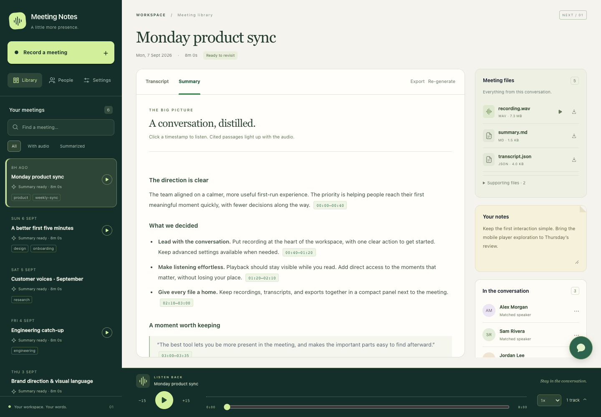

# Next / 01: a listening workspace

The `next_gen` branch turns the existing app into a working design demo: a forest-green library, warm reading surface, lime playback controls, and a compact context panel. Recording is prominent because it is the maintainer’s reported frequent workflow; no historical PostHog measurements were used to claim feature popularity.



[Mobile preview](images/next-gen-mobile.png)

## Experience

- **Record from anywhere.** The library’s primary button opens the existing recording/upload flow in a focused dialog. Mobile meeting headers also have a record button. Active recording status and stop controls remain visible.
- **Play without hunting.** Library rows have quick-play buttons. The playback dock sits outside the scrolling reader and context pane, with play/pause, ±15 seconds, a keyboard-accessible seek slider, speed, and source mute controls. Resizing and switching between transcript and summary preserve playback. Selecting another meeting or navigating to People/Settings stops this meeting’s audio.
- **Read with context.** The main area defaults to a summary when available. Tabs stay at the top of the reader; the transcript uses the available height. Arrow keys switch tabs and transcript timestamps are keyboard-accessible buttons.
- **Keep files close.** Audio, transcript, and Markdown files appear in compact rows, with supporting JSON/cache files in a disclosure. Notes, speaker management, tags, language, and recording settings stay in the context pane. On smaller screens, “Files & details” opens that pane above the player.
- **Follow the source.** Clicking a summary citation seeks and plays without leaving the summary. Explicit `[MM:SS-MM:SS]` ranges highlight their containing passage for that range. A point citation highlights until the next citation or 90 seconds, whichever comes first. This is an approximate playhead cue for point citations, not semantic audio alignment. Uncited text is never automatically aligned. Highlighting remains at the selected position while paused. In transcript-only meetings, citation clicks open the source transcript instead.
- **Browse quickly.** Search matches meeting names and tags in the loaded page; audio/summary filters narrow that page. Above 50 meetings the search field explicitly says “Search this page.” Pagination remains available.

The demo uses one deliberate light reading theme with a dark library/player, regardless of the operating system’s appearance. This branch retains the recording pipeline, exports, summary generation, speaker assignment, people, tags, chat and admin settings; it does not replace those services with mocked buttons.

## Try it with fictional meetings

Use a new, empty directory. The seeder refuses to overwrite any existing content.

```bash
uv run --no-project scripts/seed-design-demo.py /tmp/meeting-notes-demo
cargo run -- serve --web-ui --port 33490 --data-dir /tmp/meeting-notes-demo
```

Open <http://127.0.0.1:33490/sessions/demo-meeting-1>. Demo names, transcripts and summaries are fictional. The sample WAV files contain silence to exercise playback without real meeting audio; the flat waveform is intentional. Analytics and automatic transcription/summarization are disabled in this fixture. Real recording still uses the platform’s normal audio permissions; on macOS use the [application launcher](../README.md) for actual capture.

## Design references

- [Nielsen Norman Group: Visibility of system status](https://www.nngroup.com/articles/visibility-system-status/) informed the persistent recording state and playback position.
- [Material Design: Canonical layouts](https://m3.material.io/foundations/layout/canonical-examples/overview) informed the main reader plus supporting context pane, which becomes a drawer at narrower widths.
- [W3C: Focus not obscured](https://www.w3.org/WAI/WCAG22/Understanding/focus-not-obscured-minimum) informed reserving layout space for the player and moving the chat launcher clear of it.
- [W3C: Contrast minimum](https://www.w3.org/WAI/WCAG22/Understanding/contrast-minimum) informed the dark/light surface separation and readable body text. Focus outlines and reduced-motion support are included; these checks are not a complete accessibility audit.

## Verification

```bash
cargo test
node --test tests/*.test.mjs

# Optional browser checks: install outside the repository; requires Google Chrome.
npm install --prefix /tmp/meeting-notes-browser playwright
MEETING_NOTES_PLAYWRIGHT_MODULE=/tmp/meeting-notes-browser/node_modules/playwright/index.mjs \
  node scripts/check-design.mjs
MEETING_NOTES_PLAYWRIGHT_MODULE=/tmp/meeting-notes-browser/node_modules/playwright/index.mjs \
  node scripts/check-player.mjs
```

The browser suite runs against the isolated demo at port 33490. It exercises playback and seeking, citation highlighting, keyboard tabs, resize continuity, 390/768/1024/1440-pixel layouts, files, recording setup, search, quick play, mobile analytics settings, and note persistence. A separate synthetic audio harness verifies tracks with different durations, resuming a short track after a backward seek, and playback failure recovery. It does not start real audio capture, send LLM requests, or send PostHog events.

Screenshots are written to `/tmp/meeting-notes-preview` by default. Set `MEETING_NOTES_DEMO_URL` or `MEETING_NOTES_PREVIEW_DIR` to use a different server/output directory.
